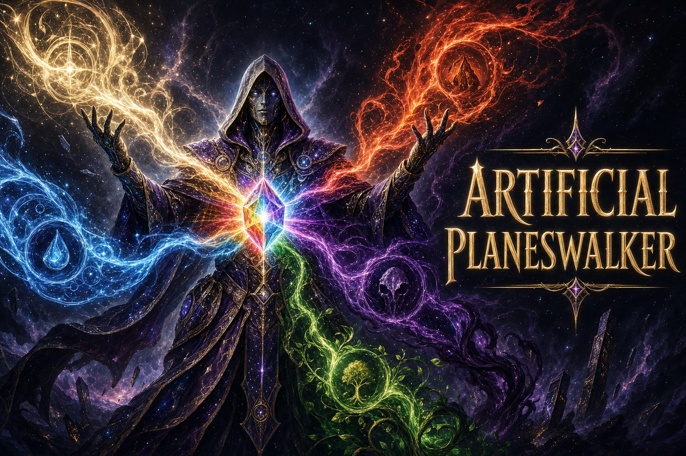

# Artificial Planeswalker

[](https://github.com/Sathias23/Artificial-Planeswalker/actions/workflows/ci.yml)
[](LICENSE)



An intelligent **Magic: The Gathering** deck-building assistant, exposed as a local
[MCP](https://modelcontextprotocol.io) server over a Scryfall card database.

Card lookup, multi-format deck validation, mana-curve and synergy analysis, and **local
semantic card search** — all driven by your MCP client (Claude Code, Claude Desktop, Cursor, …).
The server is **stateless** and makes **no LLM calls** of its own, so **no API key is required**:
your client supplies the model, the server supplies fast, accurate MTG data and analysis.

---

## What it does

| Capability | Tools |
|------------|-------|
| **Card lookup & search** | `lookup_card_by_name`, `search_cards` |
| **Semantic search** (local embeddings, no network) | `semantic_search_cards`, `find_similar_cards` |
| **Deck management** | `create_deck`, `list_decks`, `load_deck`, `delete_deck`, `add_card_to_deck`, `remove_card_from_deck`, `view_deck` |
| **Deck analysis** | `analyze_mana_curve`, `detect_synergies`, `validate_deck` |
| **First-run setup** | `initialize_database`, `build_search_index` |

Four companion **skills** layer expert reasoning on top of the tools —
`magic-deckbuilding` (the orchestrator), `synergy-discovery`, `mana-curve-analysis`, and
`format-legality` — so a client can go from "improve my deck" to ranked, reasoned swaps.

## Requirements

- **Python 3.12+**
- **[uv](https://docs.astral.sh/uv/)** (package manager / runner)
- ~300 MB of disk for the card database + embedding index (built from a one-time ~500 MB download on first run)

## Quick start

```bash
git clone https://github.com/Sathias23/Artificial-Planeswalker.git
cd Artificial-Planeswalker
python3 setup.py        # installs deps + downloads the card database into a central location
```

`setup.py` is idempotent: it checks Python/uv, syncs dependencies, then downloads public
**Scryfall** bulk data (~500 MB covering every printing, deduplicated to ~35k cards with
cross-printing Arena/MTGO availability; a few minutes — no API key) into a shared OS location
(below), so every project and every MCP client reuses it. Run it once per machine.

To enable **semantic search** (`semantic_search_cards` / `find_similar_cards`), build the embedding
index once too — either ask your MCP client to run the **`build_search_index`** tool, or run
`uv run python scripts/build_card_embeddings.py`. (Until then those two tools report
`index_unavailable` with a build hint; the other tools work as soon as the card data is downloaded.)

Then point any MCP client at it — in this directory,
[`.mcp.json`](https://github.com/Sathias23/Artificial-Planeswalker/blob/master/.mcp.json) already does:

```bash
uv run python -m src.mcp_server          # stdio (default; how clients launch it)
MCP_TRANSPORT=streamable-http uv run python -m src.mcp_server   # serve over HTTP instead
```

## Connect your client

The launch command is the same everywhere — only the config file differs.

<details>
<summary><b>Claude Code</b> (plugin — tools + skills, two commands)</summary>

Install the plugin from this repo's built-in marketplace to get all 16 tools **and** the four
deckbuilding skills in any project — no clone required:

```
/plugin marketplace add Sathias23/Artificial-Planeswalker
/plugin install artificial-planeswalker@artificial-planeswalker
```

On first use, ask the assistant to run **`initialize_database`** (one-time ~500 MB card download,
a few minutes), then **`build_search_index`** for semantic search.

*Developing in this repo instead?*
[`.mcp.json`](https://github.com/Sathias23/Artificial-Planeswalker/blob/master/.mcp.json) is
auto-detected when you open the directory — that gives you the tools (the skills come from the
plugin install above).
</details>

<details>
<summary><b>OpenAI Codex</b> (plugin or manual MCP config)</summary>

**Plugin route** — verified on the Codex app for Windows. Requires Codex ≥ 0.117.0
(first-class plugin support); the desktop app has no add-marketplace UI, so run the command
below with the Codex CLI — on native Windows they share the same `%USERPROFILE%\.codex`, and
the plugin appears in the app after a restart. Add this repo as a marketplace, then install
from the `/plugins` browser:

```
codex plugin marketplace add Sathias23/Artificial-Planeswalker
```

Open the `/plugins` browser inside Codex and install **artificial-planeswalker** — that gives
you the 16 tools *and* the four deckbuilding skills. If Codex also auto-surfaces this repo's
*Claude Code* marketplace, skip it — that variant's config only works inside Claude Code
(see [openai/codex#19372](https://github.com/openai/codex/issues/19372)).

**Manual route** — clone the repo, then register the server with one command:

```bash
codex mcp add artificial-planeswalker --env MCP_TRANSPORT=stdio -- uv run --directory /absolute/path/to/Artificial-Planeswalker python -m src.mcp_server
```

or add it to `~/.codex/config.toml` yourself:

```toml
[mcp_servers.artificial-planeswalker]
command = "uv"
args = ["run", "--directory", "/absolute/path/to/Artificial-Planeswalker", "python", "-m", "src.mcp_server"]
env = { MCP_TRANSPORT = "stdio" }
```

On first use, ask the assistant to run **`initialize_database`** (one-time card download,
~2–3 min), then **`build_search_index`** for semantic search. The manual route loads the 16
tools; the skills come with the plugin route.

> **First launch is slow:** the server's first start builds its Python environment with `uv`
> (a few minutes on a cold cache). If the tools don't appear in your first session, start a
> fresh session once the build has finished.
</details>

<details>
<summary><b>Claude Desktop</b></summary>

Clone the repo, then add the server to `claude_desktop_config.json`
(Settings → Developer → Edit Config; requires `uv` on your PATH):

```json
{
  "mcpServers": {
    "artificial-planeswalker": {
      "command": "uv",
      "args": ["run", "--directory", "/absolute/path/to/Artificial-Planeswalker", "python", "-m", "src.mcp_server"]
    }
  }
}
```

No card data ships with the repo, so on first use ask the assistant to run the
**`initialize_database`** tool (a one-time ~500 MB card-data download, a few minutes) — and then
**`build_search_index`** if you want semantic search. Until then the card/deck tools reply with a
`database_not_initialized` hint instead of an error. When a new set releases, ask the assistant to
run `initialize_database` with `update=true` to pull in the new cards (then re-run
`build_search_index` to index them). Desktop loads the 16 tools; the four skills are a Claude Code
plugin feature.
</details>

<details>
<summary><b>Cursor / VS Code / Windsurf / Cline / Zed</b></summary>

Add an MCP server with:

```json
{
  "mcpServers": {
    "artificial-planeswalker": {
      "command": "uv",
      "args": ["run", "--directory", "/absolute/path/to/Artificial-Planeswalker", "python", "-m", "src.mcp_server"]
    }
  }
}
```

Config locations: Cursor `.cursor/mcp.json` · VS Code `.vscode/mcp.json` · Windsurf Cascade MCP
settings · Cline MCP panel · Zed `context_servers`. Any other MCP client works the same way.
</details>

## Where the data lives

The card database and embedding index are stored once in a **central, OS-appropriate location** so
every clone and every client shares them:

| OS | Default location |
|----|------------------|
| Windows | `%LOCALAPPDATA%\artificial-planeswalker\` |
| macOS | `~/Library/Application Support/artificial-planeswalker/` |
| Linux | `~/.local/share/artificial-planeswalker/` (honours `XDG_DATA_HOME`) |

Override with `PLANESWALKER_DATA_DIR=/your/path`, or point the engine at any SQLite file with
`CARDS_DATABASE_URL`. See
[`.env.example`](https://github.com/Sathias23/Artificial-Planeswalker/blob/master/.env.example).

### Semantic search index

`semantic_search_cards` and `find_similar_cards` query a [`sqlite-vec`](https://github.com/asg017/sqlite-vec)
vector table (`card_vec`) in the **same** SQLite file, embedded locally with
[`fastembed`](https://github.com/qdrant/fastembed) (`bge-small-en-v1.5` — no API key, no network).
Building it is a separate one-time step (see [Quick start](#quick-start)) — ask your client to run
the **`build_search_index`** tool, or run it manually:

```bash
uv run python scripts/build_card_embeddings.py    # idempotent + incremental
```

Until built, both semantic tools return a graceful `status="index_unavailable"` (never an error).
The DB runs in WAL mode — **checkpoint before copying it** (`PRAGMA wal_checkpoint(TRUNCATE);`).

## Development

```bash
uv run pytest                       # tests (add -m "not integration" to skip DB/network)
uv run ruff check . --fix           # lint
uv run ruff format .                # format
uv run mypy src/                    # strict type-check
uv run pre-commit install           # gate every commit
```

```
src/
├── data/        # SQLAlchemy models, Scryfall importers, repositories, schemas
├── logic/       # deck validation, mana curve, synergy detection
├── search/      # sqlite-vec connection + fastembed embedder (semantic search)
├── paths.py     # central data-dir resolution
└── mcp_server/  # FastMCP server + tool definitions (python -m src.mcp_server)
tests/           # unit + integration, mirroring src/
```

See [`docs/architecture.md`](https://github.com/Sathias23/Artificial-Planeswalker/blob/master/docs/architecture.md)
for the design of record and
[`CONTRIBUTING.md`](https://github.com/Sathias23/Artificial-Planeswalker/blob/master/CONTRIBUTING.md)
for the workflow.

## License & attribution

Released under the [MIT License](LICENSE).

Card data is © Wizards of the Coast, sourced from [Scryfall](https://scryfall.com/docs/api) bulk
data under Scryfall's terms. **This project bundles no card data** — it is downloaded on first run.
This project is not produced by, endorsed by, supported by, or affiliated with Scryfall.

> Artificial Planeswalker is unofficial Fan Content permitted under the
> [Wizards of the Coast Fan Content Policy](https://company.wizards.com/en/legal/fancontentpolicy).
> Not approved or endorsed by Wizards. Portions of the materials used are property of Wizards of
> the Coast. ©Wizards of the Coast LLC.

## Acknowledgments

- [Scryfall](https://scryfall.com/docs/api) — MTG card data
- [Model Context Protocol](https://modelcontextprotocol.io) & FastMCP — server framework
- [sqlite-vec](https://github.com/asg017/sqlite-vec) & [fastembed](https://github.com/qdrant/fastembed) — local semantic search
