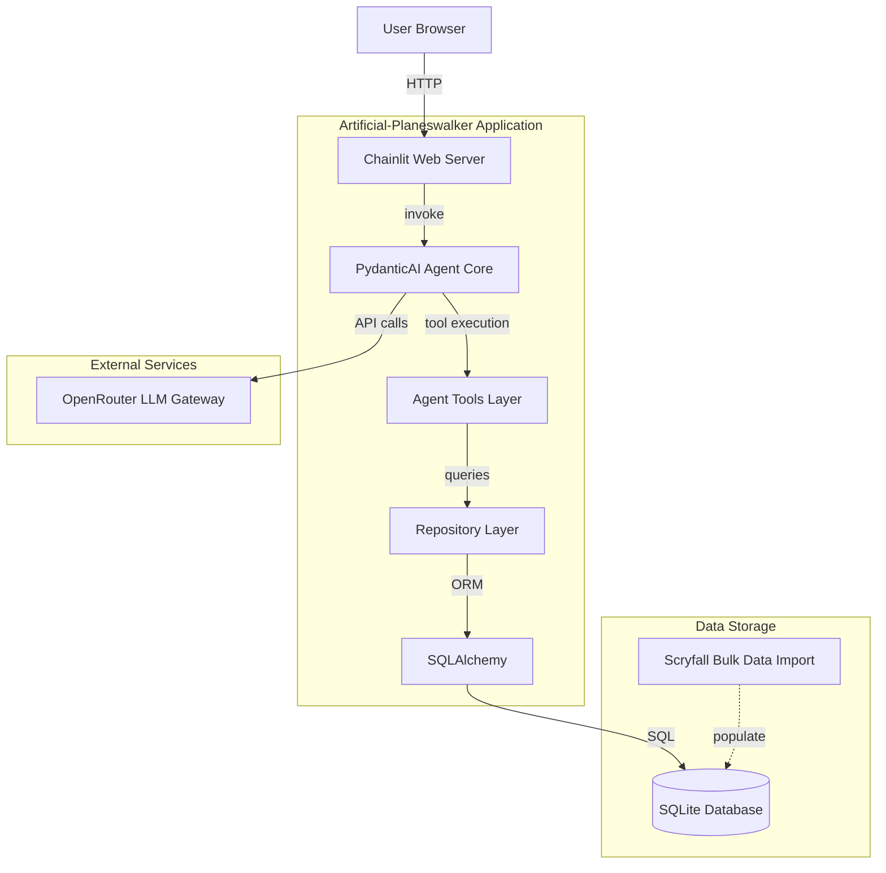
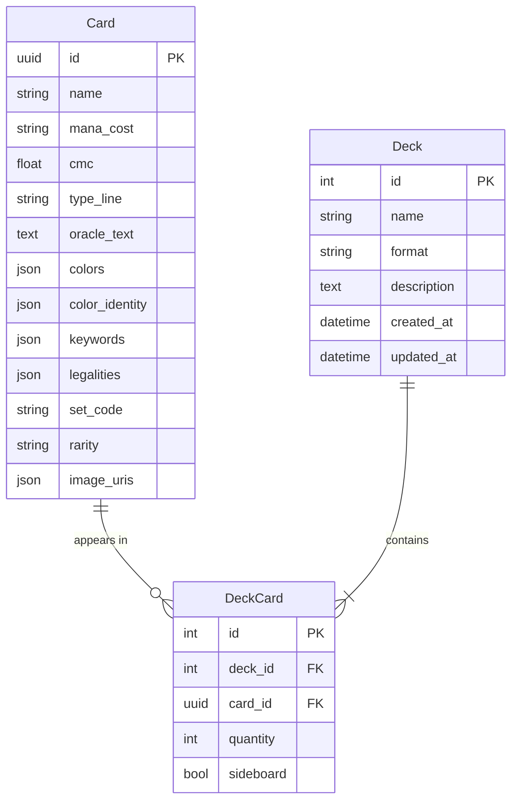
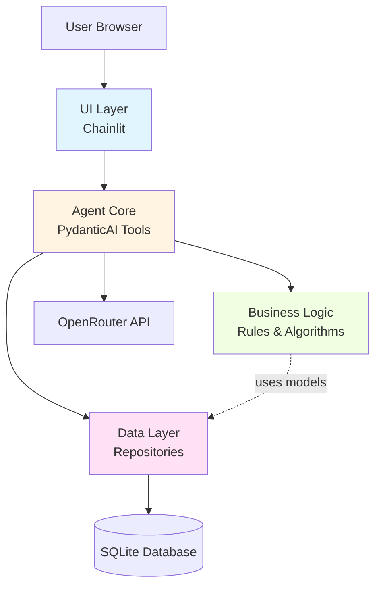
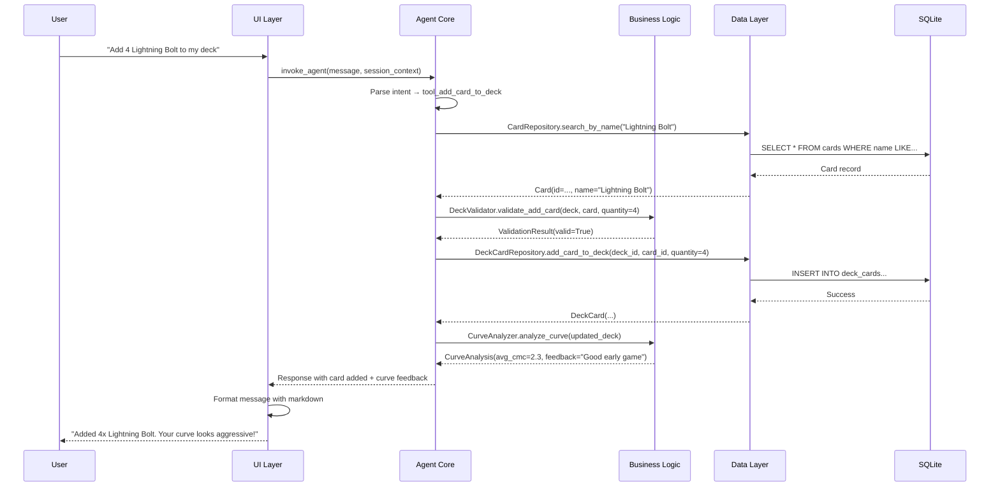
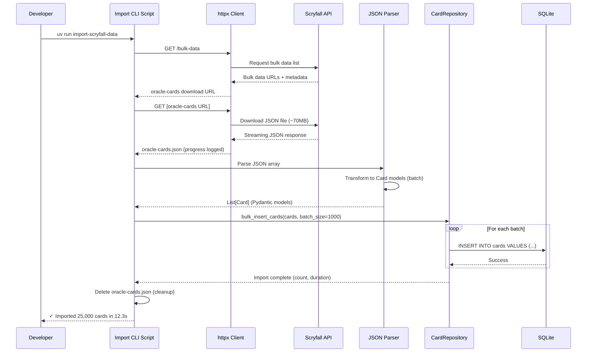
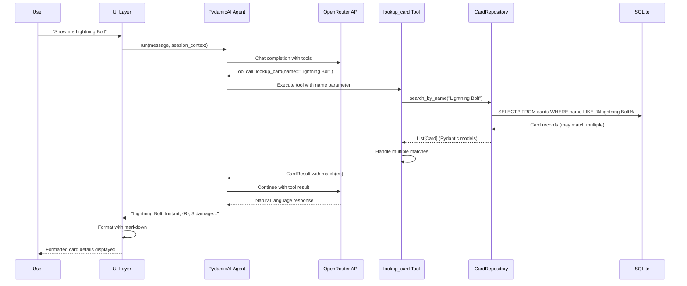
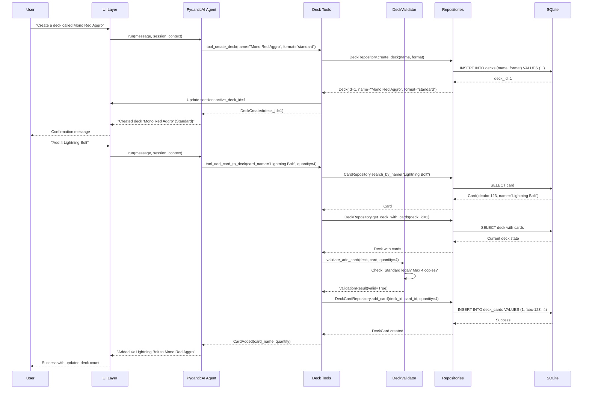
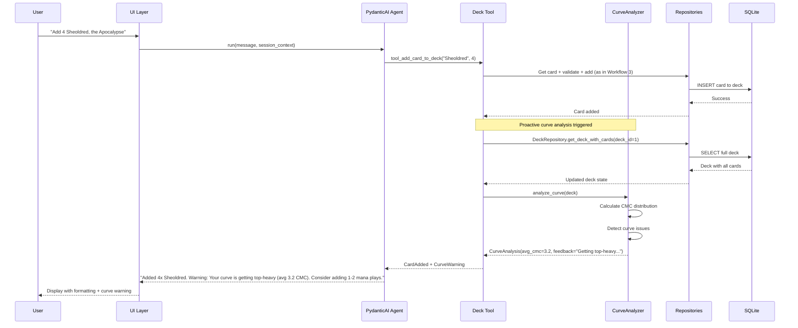
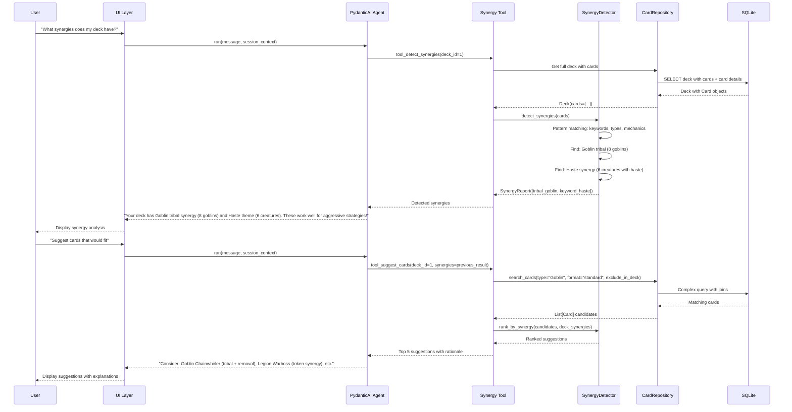

# Artificial-Planeswalker Architecture Document

## Introduction

This document outlines the overall project architecture for **Artificial-Planeswalker**, including backend systems, shared services, and non-UI specific concerns. Its primary goal is to serve as the guiding architectural blueprint for AI-driven development, ensuring consistency and adherence to chosen patterns and technologies.

**Relationship to Frontend Architecture:**
Since the project includes a significant user interface (Chainlit chat for MVP, with future CopilotKit + AG-UI replacement planned), this architecture document will focus on the backend, agent layer, and data infrastructure. Core technology stack choices documented herein (see "Tech Stack") are definitive for the entire project, including any frontend components.

### Starter Template or Existing Project

**Decision:** No starter template will be used. The project will be built from scratch with manual configuration of all tooling, following Python best practices for project structure and UV-based dependency management.

**Rationale:**
- The combination of PydanticAI + Chainlit + SQLAlchemy + OpenRouter is specialized and doesn't have a standard boilerplate
- PRD explicitly defines technical stack and structure, providing clear guidance
- Manual setup ensures full control over architecture decisions and avoids unnecessary starter template constraints
- UV package management (per user's global preferences) simplifies dependency management without needing a template

### Change Log

| Date | Version | Description | Author |
|------|---------|-------------|--------|
| 2025-10-12 | 1.0 | Initial architecture document creation | Winston (Architect) |
| 2025-10-12 | 1.1 | Updated Epic 1 implementation sequence to match PRD v1.1 story reordering (1.3↔1.4, added 1.5) | Sarah (PO Agent) |

## High Level Architecture

### Technical Summary

Artificial-Planeswalker employs a **modular monolithic architecture** with three distinct layers: data infrastructure (SQLAlchemy + SQLite), intelligent agent core (PydanticAI with OpenRouter), and conversational UI (Chainlit). The system prioritizes offline-capable card lookups via local Scryfall data storage, enabling instant queries without API rate limits. Core architectural patterns include the **Repository Pattern** for data access, **Tool-based Agent Architecture** for extensible AI capabilities, and **Session-based Context Management** for stateful deck building conversations. This design directly supports the PRD's goals of fast card access, intelligent deck building assistance, and clean UI/logic separation for future frontend replacement (CopilotKit + AG-UI).

### High Level Overview

**1. Architectural Style:** **Modular Monolith**
   - Single Python application with clear module boundaries
   - Three primary modules: `data` (persistence), `agent` (intelligence), `ui` (Chainlit interface)
   - Appropriate for MVP scope while maintaining extensibility

**2. Repository Structure:** **Monorepo** (from PRD)
   - Single Git repository containing all modules
   - Simplified dependency management and deployment for MVP
   - Clear directory separation enables future extraction if needed

**3. Service Architecture:** **Single-Process Application**
   - All components run in one Python process
   - Chainlit server hosts the web interface and orchestrates agent calls
   - SQLite database accessed via SQLAlchemy ORM
   - No service-to-service communication overhead

**4. Primary User Flow:**
   - User sends natural language message via Chainlit chat →
   - Chainlit message handler invokes PydanticAI agent with user input →
   - Agent determines intent and selects appropriate tool(s) (card query, deck management, analysis) →
   - Tools execute database queries via SQLAlchemy repositories →
   - Results return through agent to Chainlit for formatted display →
   - Session maintains deck building context across conversation

**5. Key Architectural Decisions:**

   - **Local Scryfall Data Storage:** Download bulk data once, query locally without API limits (addresses NFR1)
   - **PydanticAI Tool Architecture:** Extensible, type-safe tool definitions enable adding new capabilities without refactoring
   - **UI Layer Abstraction:** Agent logic has no Chainlit dependencies, enabling future UI replacement (addresses NFR6)
   - **SQLite for MVP:** File-based simplicity, zero configuration, sufficient performance for single-user local development
   - **OpenRouter Integration:** Model-agnostic LLM access enables testing multiple AI providers (GPT-4, Claude, etc.)

### High Level Project Diagram



### Architectural and Design Patterns

**1. Repository Pattern (Data Access)**
   - **Description:** Abstract all database access behind repository interfaces
   - **Implementation:** `CardRepository`, `DeckRepository` classes encapsulate SQLAlchemy queries
   - **Rationale:**
     - Enables testing agent logic without database dependencies
     - Provides clean interface for tools layer
     - Supports future database migration (SQLite → PostgreSQL) if needed
   - **Alternatives Considered:**
     - Direct SQLAlchemy queries in tools (rejected - tight coupling, hard to test)
     - Active Record pattern (rejected - Pydantic models conflict with SQLAlchemy models)

**2. Tool-Based Agent Architecture (PydanticAI Pattern)**
   - **Description:** Agent capabilities defined as discrete, type-safe tool functions
   - **Implementation:** Tools for card lookup, advanced search, deck CRUD, curve analysis, synergy detection
   - **Rationale:**
     - Aligns with PydanticAI's native architecture
     - Each tool is independently testable
     - New capabilities added without modifying core agent logic
     - Type safety via Pydantic models ensures correct tool invocation
   - **Alternatives Considered:**
     - Monolithic agent with hardcoded logic (rejected - inflexible, untestable)
     - Chain-of-thought without tools (rejected - lacks structured data access)

**3. Session-Based Context Management (Conversational State)**
   - **Description:** Chainlit sessions maintain user-specific state (active deck, format filter, conversation history)
   - **Implementation:** Session storage for active deck ID, format filter, conversation context
   - **Rationale:**
     - Enables stateful deck building across multiple messages
     - Supports follow-up questions without repeating context
     - Isolates concurrent users in multi-user future scenarios
   - **Alternatives Considered:**
     - Stateless agent (rejected - poor UX for deck building workflows)
     - Database-persisted sessions (deferred - unnecessary complexity for MVP)

**4. Strategy Pattern (LLM Provider Abstraction)**
   - **Description:** OpenRouter provides unified interface for multiple LLM backends
   - **Implementation:** Environment-based model selection (GPT-4, Claude, open-source models)
   - **Rationale:**
     - Enables A/B testing different models for MTG domain performance
     - Protects against single provider rate limits or outages
     - OpenRouter handles API compatibility across providers
   - **Alternatives Considered:**
     - Direct OpenAI API integration (rejected - vendor lock-in)
     - Custom provider abstraction layer (rejected - OpenRouter already solves this)

**5. Bulk Import Pattern (Data Seeding)**
   - **Description:** One-time Scryfall bulk data download and database population
   - **Implementation:** CLI script downloads JSON, parses, bulk inserts via SQLAlchemy
   - **Rationale:**
     - Avoids API rate limits during queries (addresses NFR1)
     - Enables instant card lookups without network latency
     - Supports offline development and testing
   - **Alternatives Considered:**
     - Real-time Scryfall API queries (rejected - rate limits, latency, online dependency)
     - Cached API responses (rejected - complex cache invalidation, still requires initial API calls)

## Tech Stack

This section provides the **definitive technology selections** for Artificial-Planeswalker. All technology choices documented here are the single source of truth for the project.

### Cloud Infrastructure

- **Provider:** None (Local development for MVP)
- **Key Services:** N/A
- **Deployment Regions:** Local development environment

**Note:** Cloud deployment deferred to post-MVP. Future containerized deployment (Docker) planned for cloud hosting if project is released publicly.

### Technology Stack Table

| Category | Technology | Version | Purpose | Rationale |
|----------|-----------|---------|---------|-----------|
| **Language** | Python | 3.12 | Primary development language | Latest stable, PEP 695 type improvements, performance enhancements |
| **Package Manager** | UV | 0.4+ | Dependency and environment management | Per user preference, fast Rust-based pip alternative |
| **Agent Framework** | PydanticAI | 0.0.14+ | AI agent orchestration | Type-safe tool definitions, native Pydantic integration |
| **LLM Gateway** | OpenRouter | API v1 | Multi-provider LLM access | Model flexibility, unified API, PRD requirement |
| **LLM Model (Primary)** | GPT-4 Turbo | gpt-4-turbo-2024-04-09 | Primary LLM for agent | Strong reasoning, JSON mode support, reliable |
| **LLM Model (Alt)** | Claude 3.5 Sonnet | claude-3-5-sonnet-20241022 | Alternative LLM for testing | Excellent instruction following, good for structured tasks |
| **UI Framework** | Chainlit | 1.3+ | Chat interface | PRD requirement, ChatGPT-style UI, Python-native |
| **ORM** | SQLAlchemy | 2.0+ | Database access layer | Type-safe queries, relationship management, PRD requirement |
| **Database** | SQLite | 3.45+ (bundled) | Local data storage | Zero-config, file-based, PRD requirement |
| **Data Validation** | Pydantic | 2.9+ | Type safety and validation | Native PydanticAI integration, SQLAlchemy compatibility |
| **HTTP Client** | httpx | 0.27+ | Scryfall bulk data download | Async support, modern requests alternative |
| **Testing Framework** | pytest | 8.3+ | Unit and integration testing | Modern Python testing, extensive plugin ecosystem |
| **Async Testing** | pytest-asyncio | 0.24+ | Async test support | PydanticAI async tool testing |
| **Test Coverage** | pytest-cov | 6.0+ | Code coverage reporting | Coverage metrics for PRD testing requirements |
| **Linting/Formatting** | Ruff | 0.6+ | Code quality enforcement | Fast Rust-based linter+formatter, PRD requirement |
| **Type Checking** | mypy | 1.11+ | Static type analysis | Strict type safety, PRD requirement |
| **Pre-commit Hooks** | pre-commit | 3.8+ | Git hook management | Automated quality checks, PRD requirement |

### Technology Selection Notes

**Python 3.12 Selection:**
- Chosen over PRD minimum 3.11 for latest features (PEP 695 generic type syntax, performance improvements)
- Minimal compatibility risk - all dependencies support 3.12
- Enables modern type hints: `type CardList = list[Card]`

**LLM Model Strategy:**
- Two models specified for A/B testing (GPT-4 Turbo as primary, Claude 3.5 Sonnet as alternative)
- OpenRouter enables easy addition of more models post-MVP
- Model selection configurable via environment variables

**SQLAlchemy 2.0+ Selection:**
- Modern API with improved type hints over 1.x
- Native async support (future-proof)
- Better Pydantic integration

**Ruff over Black+Flake8+isort:**
- Single tool replacing multiple linters/formatters
- 10-100x faster (Rust-based)
- Unified configuration

**Intentionally Excluded from MVP:**
- CI/CD tools (GitHub Actions, etc.) - pre-commit hooks sufficient per PRD
- Monitoring/observability (Prometheus, Sentry, etc.) - deferred to production deployment
- Containerization (Docker, Docker Compose) - deferred to post-MVP cloud deployment
- Frontend build tools (webpack, vite, etc.) - Chainlit handles UI bundling

## Data Models

### Card

**Purpose:** Represents a Magic: The Gathering card from Scryfall bulk data. This is the foundational entity enabling card lookups, format filtering, and deck building.

**Key Attributes:**
- `id`: UUID (primary key) - Scryfall's unique card identifier
- `name`: String - Card name (e.g., "Lightning Bolt")
- `mana_cost`: String - Mana cost in Scryfall notation (e.g., "{R}")
- `cmc`: Float - Converted mana cost / mana value (e.g., 1.0)
- `type_line`: String - Full type line (e.g., "Instant")
- `oracle_text`: Text - Rules text of the card
- `colors`: JSON/Array - Color identity ["R"], ["U", "B"], etc.
- `color_identity`: JSON/Array - Commander color identity (includes mana symbols in text)
- `keywords`: JSON/Array - Keyword abilities (e.g., ["Haste", "Flying"])
- `legalities`: JSON - Format legality mapping (e.g., {"standard": "legal", "modern": "legal"})
- `set_code`: String - Set code (e.g., "ONE" for Phyrexia: All Will Be One)
- `rarity`: String - Card rarity ("common", "uncommon", "rare", "mythic")
- `image_uris`: JSON - Scryfall image URLs (optional, for future visual features)

**Relationships:**
- One-to-Many with `DeckCard` (a card can appear in multiple decks)

**Design Notes:**
- UUID primary key matches Scryfall's card IDs for future API sync compatibility
- JSON fields for arrays/objects (colors, legalities) leverage SQLite JSON1 extension
- Indexed fields: name (partial match queries), cmc (curve queries), colors (color filtering), legalities (format filtering)

### Deck

**Purpose:** Represents a user-created deck for a specific format (Standard for MVP). Tracks deck metadata and enables CRUD operations.

**Key Attributes:**
- `id`: Integer (primary key, auto-increment)
- `name`: String - User-provided deck name (e.g., "Mono Red Aggro")
- `format`: String - Magic format (e.g., "standard") - enum validated
- `description`: Text (optional) - User notes about deck strategy
- `created_at`: DateTime - Timestamp of deck creation
- `updated_at`: DateTime - Timestamp of last modification

**Relationships:**
- One-to-Many with `DeckCard` (a deck contains multiple card entries)
- Through `DeckCard`, Many-to-Many with `Card`

**Design Notes:**
- Integer PK for simplicity in local MVP (human-readable IDs)
- Format field validated against enum to prevent invalid formats
- No user/owner field - MVP is single-user local app
- Timestamps enable audit trail and "recently modified" features

### DeckCard

**Purpose:** Join table representing the many-to-many relationship between Decks and Cards, with quantity tracking.

**Key Attributes:**
- `id`: Integer (primary key, auto-increment)
- `deck_id`: Integer (foreign key → Deck.id)
- `card_id`: UUID (foreign key → Card.id)
- `quantity`: Integer - Number of copies in deck (1-4 for most cards, unlimited for basic lands)
- `sideboard`: Boolean - Whether card is in sideboard vs mainboard (default: False)

**Relationships:**
- Many-to-One with `Deck`
- Many-to-One with `Card`

**Design Notes:**
- Quantity field enables "4x Lightning Bolt" tracking
- Sideboard flag prepares for future sideboard support (deferred in MVP)
- Unique constraint on (deck_id, card_id, sideboard) prevents duplicate entries
- Cascade delete when deck deleted

### Entity Relationship Diagram



## Components

### 1. Data Layer (`src/data/`)

**Responsibility:** Database access, ORM models, and repository pattern implementation for all persistence operations.

**Key Interfaces:**
- `CardRepository`: Card query operations (search by name, filter by criteria, format legality checks)
- `DeckRepository`: Deck CRUD operations (create, read, update, delete decks)
- `DeckCardRepository`: Deck-card relationship management (add/remove cards, update quantities)
- `BulkImporter`: Scryfall bulk data download and database population

**Dependencies:**
- SQLAlchemy (ORM)
- SQLite (database)
- httpx (Scryfall data download)

**Technology Stack:**
- SQLAlchemy 2.0+ models with declarative base
- Repository classes return Pydantic models (not SQLAlchemy models) to decouple layers
- Connection pooling via SQLAlchemy engine
- Alembic for migrations (optional for MVP)

**Design Notes:**
- No business logic in this layer - pure data access
- All queries return typed Pydantic models, never raw SQLAlchemy objects
- Repositories are injected into agent tools (dependency injection)
- Transaction management handled at repository level

### 2. Agent Core (`src/agent/`)

**Responsibility:** PydanticAI agent orchestration, tool definitions, LLM integration via OpenRouter, and conversational intelligence.

**Key Interfaces:**
- `PlaneswalkerAgent`: Main agent class with tool registry
- Tool functions:
  - `tool_lookup_card(name: str)`: Find cards by name
  - `tool_search_cards(criteria: CardSearchCriteria)`: Advanced card search
  - `tool_create_deck(name: str, format: str)`: Create new deck
  - `tool_add_card_to_deck(card_name: str, quantity: int)`: Add card to active deck
  - `tool_remove_card_from_deck(card_name: str, quantity: int)`: Remove card from deck
  - `tool_view_deck()`: Display current deck contents
  - `tool_analyze_curve()`: Mana curve analysis
  - `tool_detect_synergies()`: Basic synergy detection
  - `tool_suggest_cards()`: Proactive card suggestions

**Dependencies:**
- PydanticAI (agent framework)
- OpenRouter (LLM gateway)
- Data Layer repositories (injected)

**Technology Stack:**
- PydanticAI Agent with typed tool definitions
- Pydantic models for tool inputs/outputs
- OpenRouter client for LLM calls
- Environment-based model selection

**Design Notes:**
- No UI dependencies - agent has no knowledge of Chainlit
- Tools are stateless - receive session context as parameters
- All tool inputs/outputs use Pydantic models for type safety
- Agent returns structured responses that UI layer formats

### 3. Business Logic (`src/logic/`)

**Responsibility:** Domain logic for deck building rules, synergy detection algorithms, mana curve analysis, and format validation.

**Key Interfaces:**
- `DeckValidator`: Validate deck construction rules (60+ cards, max 4 copies, format legality)
- `CurveAnalyzer`: Calculate mana curve distribution and provide feedback
- `SynergyDetector`: Pattern-based synergy detection (tribal, keywords, mechanics)
- `FormatRules`: Format-specific rules engine (Standard rules for MVP)

**Dependencies:**
- Data Layer models (Pydantic Card/Deck models)
- No database or UI dependencies

**Technology Stack:**
- Pure Python domain logic
- Type-safe functions with Pydantic model inputs
- Rule-based algorithms (no ML for MVP synergy detection)

**Design Notes:**
- Independently testable - no external dependencies beyond Pydantic models
- Agent tools call business logic classes
- Logic layer has no knowledge of database or UI
- Enables future rule extensions (Commander format, sideboard rules)

### 4. UI Layer (`src/ui/`)

**Responsibility:** Chainlit web interface, session management, message formatting, and user interaction handling.

**Key Interfaces:**
- `@cl.on_chat_start`: Initialize session, create agent instance
- `@cl.on_message`: Handle user messages, invoke agent, format responses
- `SessionManager`: Manage user session state (active deck, preferences)
- `MessageFormatter`: Format agent responses for Chainlit display (card lists, deck summaries)

**Dependencies:**
- Chainlit (UI framework)
- Agent Core (invokes agent)

**Technology Stack:**
- Chainlit 1.3+ decorators and message APIs
- Chainlit session storage for stateful conversations
- Markdown formatting for structured card/deck display

**Design Notes:**
- Thin layer - minimal logic, delegates to agent
- No direct database access - goes through agent
- Formats agent responses for chat display
- Manages active deck context in session
- Future replacement with CopilotKit + AG-UI requires only changing this layer

### Component Diagrams

**Component Dependency Graph:**



**Component Interaction Example - "Add Lightning Bolt to Deck":**



## External APIs

### Scryfall API (Bulk Data Only)

- **Purpose:** One-time download of Magic: The Gathering card database for local storage
- **Documentation:** https://scryfall.com/docs/api/bulk-data
- **Base URL(s):** https://api.scryfall.com
- **Authentication:** None required (public API)
- **Rate Limits:**
  - 10 requests per second for API calls
  - Bulk data downloads not rate-limited (large files ~100MB)

**Key Endpoints Used:**
- `GET /bulk-data` - List available bulk data files with download URLs
- Download URL from bulk data response - Direct download of JSON file (e.g., `oracle-cards` or `default-cards`)

**Integration Notes:**
- **One-time operation:** Bulk data downloaded during initial setup, not during regular application use
- **Update strategy:** Manual re-import when Scryfall releases new sets (automated updates post-MVP)
- **File selection:** Use `oracle-cards` endpoint (unique cards only, ~70MB) vs `default-cards` (all printings, ~180MB)
- **Recommendation:** Start with `oracle-cards` for MVP - smaller, contains all unique cards with oracle text
- **Error handling:** Network timeout during download (large file), retry with exponential backoff
- **Storage:** Downloaded JSON temporarily stored, then parsed and imported to SQLite (can delete JSON after import)

**Scryfall JSON Schema (Relevant Fields):**
```json
{
  "id": "uuid",
  "name": "string",
  "mana_cost": "string",
  "cmc": "number",
  "type_line": "string",
  "oracle_text": "string",
  "colors": ["string"],
  "color_identity": ["string"],
  "keywords": ["string"],
  "legalities": {"format": "legal|not_legal|restricted|banned"},
  "set": "string",
  "rarity": "string",
  "image_uris": {"small": "url", "normal": "url", ...}
}
```

### OpenRouter API

- **Purpose:** LLM gateway for PydanticAI agent, enabling multi-model testing and inference
- **Documentation:** https://openrouter.ai/docs
- **Base URL(s):** https://openrouter.ai/api/v1
- **Authentication:** Bearer token (API key in `Authorization: Bearer $OPENROUTER_API_KEY` header)
- **Rate Limits:**
  - Varies by model and account tier
  - Typical: 200 requests/minute for GPT-4 Turbo
  - Monitor via response headers: `x-ratelimit-remaining`

**Key Endpoints Used:**
- `POST /chat/completions` - OpenAI-compatible chat completion endpoint
  - Model selection via request body: `{"model": "openai/gpt-4-turbo", ...}`
  - Streaming support: `{"stream": true}` for real-time responses
  - Tool/function calling: OpenAI function calling format

**Integration Notes:**
- **Model Configuration:** Environment variable `OPENROUTER_MODEL` to select model
  - Primary: `openai/gpt-4-turbo` (gpt-4-turbo-2024-04-09)
  - Alternative: `anthropic/claude-3.5-sonnet` (claude-3-5-sonnet-20241022)
- **PydanticAI Integration:** OpenRouter API is OpenAI-compatible, PydanticAI supports OpenAI format natively
- **Error Handling:**
  - 429 Rate Limit: Exponential backoff with retry
  - 401 Authentication: Log clear error, check API key
  - 503 Model Unavailable: Fall back to alternative model if configured
- **Cost Management:**
  - OpenRouter charges per-token, track usage via response `x-tokens-used` header
  - Set per-request budget limits in OpenRouter dashboard
- **Streaming:** Enable streaming for better UX (Chainlit displays response incrementally)
- **Tool Calling:** Ensure model supports function calling (GPT-4 Turbo and Claude 3.5 Sonnet both support)
- **Security:** Store `OPENROUTER_API_KEY` in `.env` file, never commit to Git

## Core Workflows

### Workflow 1: Scryfall Bulk Data Import (One-Time Setup)



### Workflow 2: Natural Language Card Lookup



### Workflow 3: Create Deck and Add Cards



### Workflow 4: Mana Curve Analysis with Proactive Feedback



### Workflow 5: Synergy Detection and Card Suggestions



## Database Schema

### SQLite Database Schema (DDL)

```sql
-- ============================================================
-- Artificial-Planeswalker Database Schema
-- Database: SQLite 3.45+
-- ORM: SQLAlchemy 2.0+
-- ============================================================

-- Enable foreign key constraints (required for SQLite)
PRAGMA foreign_keys = ON;

-- Enable JSON1 extension functions (bundled with Python 3.12+)
-- SELECT json_extract, json_array, json_object functions available

-- ============================================================
-- TABLE: cards
-- Purpose: Scryfall card data for MTG card database
-- ============================================================
CREATE TABLE cards (
    id TEXT PRIMARY KEY,  -- Scryfall UUID (e.g., '550e8400-e29b-41d4-a716-446655440000')
    name TEXT NOT NULL,
    mana_cost TEXT,  -- Nullable for lands without mana cost
    cmc REAL NOT NULL DEFAULT 0.0,  -- Converted mana cost / mana value
    type_line TEXT NOT NULL,
    oracle_text TEXT,  -- Nullable for tokens/cards without text
    colors TEXT,  -- JSON array: '["R"]', '["U","B"]', NULL for colorless
    color_identity TEXT,  -- JSON array for Commander color identity
    keywords TEXT,  -- JSON array: '["Haste","Flying"]'
    legalities TEXT NOT NULL,  -- JSON object: '{"standard":"legal","modern":"legal"}'
    set_code TEXT NOT NULL,
    rarity TEXT NOT NULL,  -- 'common', 'uncommon', 'rare', 'mythic'
    image_uris TEXT,  -- JSON object with image URLs (optional for MVP)
    created_at DATETIME DEFAULT CURRENT_TIMESTAMP,
    updated_at DATETIME DEFAULT CURRENT_TIMESTAMP
);

-- Indexes for performance (NFR7: <500ms query time)
CREATE INDEX idx_cards_name ON cards(name COLLATE NOCASE);  -- Case-insensitive name search
CREATE INDEX idx_cards_cmc ON cards(cmc);  -- Mana curve queries
CREATE INDEX idx_cards_type_line ON cards(type_line);  -- Type filtering (creature, instant, etc.)
CREATE INDEX idx_cards_set_code ON cards(set_code);  -- Set filtering
CREATE INDEX idx_cards_rarity ON cards(rarity);  -- Rarity filtering

-- JSON index for format legality (SQLite 3.38+)
-- Enables fast Standard format filtering
CREATE INDEX idx_cards_legalities_standard ON cards(json_extract(legalities, '$.standard'));

-- ============================================================
-- TABLE: decks
-- Purpose: User-created decks
-- ============================================================
CREATE TABLE decks (
    id INTEGER PRIMARY KEY AUTOINCREMENT,
    name TEXT NOT NULL,
    format TEXT NOT NULL CHECK(format IN ('standard', 'modern', 'commander', 'pioneer', 'legacy', 'vintage', 'pauper')),
    description TEXT,  -- Optional user notes
    created_at DATETIME DEFAULT CURRENT_TIMESTAMP,
    updated_at DATETIME DEFAULT CURRENT_TIMESTAMP
);

-- Index for deck lookup by name
CREATE INDEX idx_decks_name ON decks(name COLLATE NOCASE);
CREATE INDEX idx_decks_format ON decks(format);

-- Trigger to update updated_at on deck modification
CREATE TRIGGER update_deck_timestamp
AFTER UPDATE ON decks
FOR EACH ROW
BEGIN
    UPDATE decks SET updated_at = CURRENT_TIMESTAMP WHERE id = OLD.id;
END;

-- ============================================================
-- TABLE: deck_cards
-- Purpose: Many-to-many relationship between decks and cards
-- ============================================================
CREATE TABLE deck_cards (
    id INTEGER PRIMARY KEY AUTOINCREMENT,
    deck_id INTEGER NOT NULL,
    card_id TEXT NOT NULL,
    quantity INTEGER NOT NULL CHECK(quantity > 0 AND quantity <= 100),  -- Max 100 for basic lands
    sideboard BOOLEAN NOT NULL DEFAULT 0,  -- 0=mainboard, 1=sideboard
    added_at DATETIME DEFAULT CURRENT_TIMESTAMP,

    FOREIGN KEY (deck_id) REFERENCES decks(id) ON DELETE CASCADE,
    FOREIGN KEY (card_id) REFERENCES cards(id) ON DELETE RESTRICT,

    -- Prevent duplicate card entries in same deck/board
    UNIQUE(deck_id, card_id, sideboard)
);

-- Indexes for deck card queries
CREATE INDEX idx_deck_cards_deck_id ON deck_cards(deck_id);
CREATE INDEX idx_deck_cards_card_id ON deck_cards(card_id);

-- ============================================================
-- VIEWS: Useful query shortcuts
-- ============================================================

-- View: Deck summary with card count
CREATE VIEW deck_summary AS
SELECT
    d.id,
    d.name,
    d.format,
    d.description,
    COUNT(CASE WHEN dc.sideboard = 0 THEN 1 END) as mainboard_count,
    SUM(CASE WHEN dc.sideboard = 0 THEN dc.quantity ELSE 0 END) as total_cards,
    COUNT(CASE WHEN dc.sideboard = 1 THEN 1 END) as sideboard_count,
    SUM(CASE WHEN dc.sideboard = 1 THEN dc.quantity ELSE 0 END) as sideboard_cards,
    d.created_at,
    d.updated_at
FROM decks d
LEFT JOIN deck_cards dc ON d.id = dc.deck_id
GROUP BY d.id;

-- View: Standard-legal cards (fast lookup)
CREATE VIEW standard_cards AS
SELECT * FROM cards
WHERE json_extract(legalities, '$.standard') = 'legal';
```

### Database Design Notes

**Schema Decisions:**

1. **cards.id as TEXT (UUID):** Matches Scryfall's ID format for future sync capabilities
2. **JSON Fields:** Arrays and objects stored as JSON (colors, keywords, legalities) - SQLite JSON1 extension provides efficient querying
3. **Indexes for Performance:** Name (case-insensitive), CMC (curve analysis), Standard legality (most common filter)
4. **deck_cards.quantity Constraint:** CHECK allows 1-100 copies (business logic validates 4-copy rule for non-basics)
5. **Foreign Key Cascade:** Deleting deck removes card entries automatically; cards protected from deletion if in use
6. **Views:** `deck_summary` and `standard_cards` optimize frequently-accessed queries

**SQLAlchemy Model Mapping:**
- `cards` table → `Card` SQLAlchemy model → `CardPydantic` Pydantic model (returned by repositories)
- `decks` table → `Deck` SQLAlchemy model → `DeckPydantic` Pydantic model
- `deck_cards` table → `DeckCard` SQLAlchemy model (join table, not directly exposed)

**Migration Strategy:**
- MVP: Run DDL script directly via SQLAlchemy `create_all()`
- Post-MVP: Add Alembic for schema versioning
- Data refresh: Drop/recreate `cards` table when re-importing Scryfall data (decks preserved)

**Performance Estimates:**
- Database size: ~500MB for 25,000 cards with JSON fields
- Query performance: <500ms for indexed queries (meets NFR7)
- Complex joins for synergy detection may require optimization post-MVP

## Source Tree

```
artificial-planeswalker/
├── .env.example                 # Example environment variables (committed)
├── .gitignore                   # Python, SQLite, .env exclusions
├── .pre-commit-config.yaml      # Pre-commit hooks (ruff, mypy)
├── pyproject.toml               # UV project config, dependencies, tool settings
├── README.md                    # Project setup and usage instructions
├── uv.lock                      # UV lockfile for reproducible installs
│
├── data/                        # Local data storage (gitignored)
│   ├── planeswalker.db          # SQLite database file
│   └── scryfall/                # Temporary Scryfall downloads
│       └── oracle-cards.json    # Downloaded bulk data (deleted after import)
│
├── docs/                        # Project documentation
│   ├── architecture.md          # This document
│   └── prd.md                   # Product requirements
│
├── scripts/                     # CLI utility scripts
│   ├── init_db.py               # Database initialization (Story 1.2)
│   ├── import_scryfall.py       # Bulk data import script (Story 1.4)
│   ├── validate_data_layer.py   # Epic 1 smoke test (Story 1.5)
│   └── dev_seed.py              # Optional: Seed test decks for development
│
├── src/                         # Main application code
│   ├── __init__.py
│   │
│   ├── data/                    # Data Layer - Database access
│   │   ├── __init__.py
│   │   ├── models.py            # SQLAlchemy ORM models (Card, Deck, DeckCard)
│   │   ├── schemas.py           # Pydantic schemas for data transfer
│   │   ├── database.py          # Database connection, session management
│   │   ├── repositories/        # Repository pattern implementations
│   │   │   ├── __init__.py
│   │   │   ├── card_repository.py        # Card queries
│   │   │   ├── deck_repository.py        # Deck CRUD
│   │   │   └── deck_card_repository.py   # Deck-card relationships
│   │   └── importers/           # Data import utilities
│   │       ├── __init__.py
│   │       └── scryfall_importer.py  # Bulk data download and parse
│   │
│   ├── logic/                   # Business Logic Layer - Domain rules
│   │   ├── __init__.py
│   │   ├── deck_validator.py    # Deck construction rules
│   │   ├── curve_analyzer.py    # Mana curve analysis algorithms
│   │   ├── synergy_detector.py  # Pattern-based synergy detection
│   │   └── format_rules.py      # Format-specific validation (Standard, etc.)
│   │
│   ├── agent/                   # Agent Core - PydanticAI integration
│   │   ├── __init__.py
│   │   ├── planeswalker_agent.py  # Main agent definition
│   │   ├── tools/               # Agent tool definitions
│   │   │   ├── __init__.py
│   │   │   ├── card_tools.py    # Card lookup and search tools
│   │   │   ├── deck_tools.py    # Deck management tools
│   │   │   └── analysis_tools.py  # Curve/synergy analysis tools
│   │   ├── config.py            # OpenRouter config, model selection
│   │   └── context.py           # Agent context management (session state)
│   │
│   ├── ui/                      # UI Layer - Chainlit interface
│   │   ├── __init__.py
│   │   ├── app.py               # Main Chainlit app entry point
│   │   ├── handlers.py          # Chainlit event handlers (@cl.on_message)
│   │   ├── formatters.py        # Message formatting for display
│   │   └── session.py           # Session state management
│   │
│   └── config/                  # Shared configuration
│       ├── __init__.py
│       ├── settings.py          # Application settings (env var loading)
│       └── constants.py         # Constants (formats, limits, etc.)
│
├── tests/                       # Test suite
│   ├── __init__.py
│   ├── conftest.py              # Pytest fixtures (test DB, mock repos)
│   ├── unit/                    # Unit tests (no external dependencies)
│   │   ├── __init__.py
│   │   ├── test_deck_validator.py
│   │   ├── test_curve_analyzer.py
│   │   ├── test_synergy_detector.py
│   │   └── test_repositories.py
│   └── integration/             # Integration tests (DB, agent, API)
│       ├── __init__.py
│       ├── test_scryfall_import.py
│       ├── test_agent_tools.py
│       └── test_deck_workflows.py
│
├── .chainlit/                   # Chainlit configuration (gitignored)
│   └── config.toml              # Chainlit app settings
│
└── .mypy_cache/                 # Mypy cache (gitignored)
```

### Key Directory Structure Notes

**Four-Layer Architecture in `src/`:**
- **`data/`:** Database access, ORM models, repositories (no business logic)
- **`logic/`:** Domain rules and algorithms (no database or UI dependencies)
- **`agent/`:** PydanticAI agent with tool definitions (no UI dependencies)
- **`ui/`:** Chainlit interface (thin layer, delegates to agent)
- **No circular dependencies:** Layers depend downward only (ui → agent → logic + data)

**Repository Pattern in `data/repositories/`:**
- One repository per entity (Card, Deck, DeckCard)
- Returns Pydantic models from `schemas.py`, not SQLAlchemy models
- Enables clean testing and future database migration

**Agent Tools Organization:**
- Tools grouped by domain: `card_tools.py`, `deck_tools.py`, `analysis_tools.py`
- Prepares for 10+ tool definitions without cluttering single file
- Each tool file contains related tool functions

**CLI Scripts Separation:**
- `scripts/` directory for utilities (`import_scryfall.py`, `init_db.py`)
- Not imported by application code, runnable via `uv run scripts/<script>.py`

**Test Structure:**
- `unit/` - Fast tests, mocked dependencies, no DB/API calls
- `integration/` - Full-stack tests with test database
- `conftest.py` - Shared pytest fixtures

### Essential Configuration Files

**`pyproject.toml` (UV Project Configuration):**
```toml
[project]
name = "artificial-planeswalker"
version = "0.1.0"
description = "AI-powered MTG deck building assistant"
requires-python = ">=3.12"
dependencies = [
    "pydantic>=2.9",
    "pydanticai>=0.0.14",
    "sqlalchemy>=2.0",
    "chainlit>=1.3",
    "httpx>=0.27",
]

[project.optional-dependencies]
dev = [
    "pytest>=8.3",
    "pytest-asyncio>=0.24",
    "pytest-cov>=6.0",
    "mypy>=1.11",
    "ruff>=0.6",
    "pre-commit>=3.8",
]

[tool.ruff]
line-length = 100
target-version = "py312"

[tool.mypy]
python_version = "3.12"
strict = true
warn_return_any = true
warn_unused_configs = true

[tool.pytest.ini_options]
testpaths = ["tests"]
python_files = ["test_*.py"]
python_functions = ["test_*"]
```

**`.env.example`:**
```bash
# OpenRouter API Configuration
OPENROUTER_API_KEY=your_api_key_here
OPENROUTER_MODEL=openai/gpt-4-turbo  # or anthropic/claude-3.5-sonnet

# Database Configuration
DATABASE_URL=sqlite:///data/planeswalker.db

# Application Settings
LOG_LEVEL=INFO
```

### Design Decisions

**Flat `src/` Structure:**
- Four top-level modules (`data`, `logic`, `agent`, `ui`) clearly visible
- Avoids deep nesting, easy navigation
- Scales well up to 50+ files

**Separate `schemas.py` and `models.py`:**
- `models.py` - SQLAlchemy ORM models (database representation)
- `schemas.py` - Pydantic models (API/transfer representation)
- Repositories return Pydantic schemas, not SQLAlchemy models (prevents leaky abstraction)

**`data/` Directory for Local Storage:**
- Separate from source code, easy to gitignore
- Database and temporary downloads in one place
- Clear boundary between code and data

## Infrastructure and Deployment

### Infrastructure as Code

- **Tool:** None for MVP (local development only)
- **Location:** N/A
- **Approach:** Manual local setup via README instructions

**Post-MVP Considerations:**
- Docker Compose for containerized local development
- Dockerfile for production deployment
- Cloud provider: TBD based on hosting requirements

### Deployment Strategy

- **Strategy:** Local development execution
- **CI/CD Platform:** None for MVP (pre-commit hooks sufficient)
- **Pipeline Configuration:** N/A

**Running the Application:**
```bash
# Install dependencies
uv sync

# Initialize database
uv run scripts/init_db.py

# Import Scryfall data (one-time setup)
uv run scripts/import_scryfall.py

# Run Chainlit application
uv run chainlit run src/ui/app.py
```

**Pre-commit Quality Gates:**
- Ruff linting and formatting
- mypy type checking
- Pytest unit tests (optional hook)

### Environments

- **Development:** Local machine (default)
  - SQLite database in `data/planeswalker.db`
  - OpenRouter API key from `.env` file
  - Hot reload via Chainlit's auto-reload
  - Log level: DEBUG

- **Testing:** Pytest test environment
  - In-memory SQLite database (`:memory:`)
  - Mocked OpenRouter API calls
  - Test fixtures for sample cards/decks

**Environment Promotion Flow:**
```
Developer Machine → (Future: Staging) → (Future: Production)
```

**Post-MVP:** Cloud deployment (Docker container) with environment-specific configs

### Rollback Strategy

- **Primary Method:** Git revert to previous commit
- **Trigger Conditions:** Application fails to start, critical bugs discovered
- **Recovery Time Objective:** < 5 minutes (restart application after revert)

**MVP Note:** Since deployment is local, rollback is simply `git checkout <previous-commit>` and restart application.

## Error Handling Strategy

### General Approach

- **Error Model:** Exceptions for exceptional cases, Result types for expected failures
- **Exception Hierarchy:**
  - `PlaneswalkerException` (base)
    - `DataLayerException` (database errors)
    - `ValidationException` (business rule violations)
    - `ExternalAPIException` (Scryfall, OpenRouter failures)
    - `AgentException` (PydanticAI tool execution errors)
- **Error Propagation:** Catch at boundary layers (agent tools, UI handlers), log, return user-friendly messages

### Logging Standards

- **Library:** Python standard `logging` module
- **Format:** JSON structured logging for searchability
  ```python
  {"timestamp": "2025-10-12T10:30:00Z", "level": "ERROR", "logger": "agent.tools",
   "message": "Card not found", "card_name": "Lightning Bolt", "correlation_id": "req-123"}
  ```
- **Levels:**
  - `DEBUG`: Development diagnostics, verbose agent tool execution
  - `INFO`: Normal operations (user actions, deck operations)
  - `WARNING`: Recoverable issues (rate limits approaching, card not found)
  - `ERROR`: Exceptions, failed operations (database errors, API failures)
  - `CRITICAL`: Application startup failures, unrecoverable errors
- **Required Context:**
  - **Correlation ID:** Session ID from Chainlit (track user conversation)
  - **Service Context:** Layer name (data, logic, agent, ui)
  - **User Context:** Never log sensitive data (API keys, personal info)

### Error Handling Patterns

#### External API Errors

**Scryfall Bulk Data Download:**
- **Retry Policy:** Exponential backoff, 3 retries, max 30s delay
- **Circuit Breaker:** Not needed (one-time operation)
- **Timeout Configuration:** 60s for bulk data download (large file)
- **Error Translation:**
  - Network timeout → "Failed to download Scryfall data. Check internet connection."
  - 404 Not Found → "Scryfall bulk data endpoint unavailable. Try again later."

**OpenRouter API:**
- **Retry Policy:**
  - 429 Rate Limit: Exponential backoff, respect `Retry-After` header
  - 503 Service Unavailable: 2 retries with 5s delay
  - 500 Server Error: 1 retry with 2s delay
- **Circuit Breaker:** Not implemented for MVP (acceptable latency)
- **Timeout Configuration:** 30s per LLM request
- **Error Translation:**
  - 401 Unauthorized → "OpenRouter API key invalid. Check configuration."
  - 429 Rate Limit → "Rate limit exceeded. Please wait a moment."
  - 503 Unavailable → "LLM service temporarily unavailable. Try again."

#### Business Logic Errors

**Deck Validation Failures:**
- **Custom Exceptions:**
  - `DeckValidationError` (max 4 copies violated, format legality failed)
  - `DeckConstructionError` (minimum card count not met)
- **User-Facing Errors:** Clear, actionable messages
  - "Cannot add 5th copy of Lightning Bolt (max 4 allowed)"
  - "This card is not legal in Standard format"
- **Error Codes:** Not needed for MVP (clear messages sufficient)

**Card Not Found:**
- **Handling:** Return empty result with suggestion for similar names
- **User Message:** "No card found matching 'Lightening Bolt'. Did you mean 'Lightning Bolt'?"

#### Data Consistency

- **Transaction Strategy:** SQLAlchemy sessions with explicit commits
  - Deck operations wrapped in transactions
  - Rollback on validation failures
- **Compensation Logic:** Not needed for MVP (no distributed transactions)
- **Idempotency:**
  - Deck creation: Check for duplicate name, return existing if found
  - Card addition: Use UNIQUE constraint, handle conflict gracefully

## Coding Standards

**MANDATORY for AI agents and human developers.**

### Core Standards

- **Languages & Runtimes:** Python 3.12+
- **Style & Linting:** Ruff (configured in `pyproject.toml`)
  - Line length: 100 characters
  - Import sorting: isort compatible
  - Formatting: Black compatible
- **Test Organization:**
  - Test files: `tests/unit/test_<module>.py`, `tests/integration/test_<feature>.py`
  - Test functions: `def test_<behavior>()`
  - Fixtures in `conftest.py`

### Naming Conventions

| Element | Convention | Example |
|---------|-----------|---------|
| Modules | snake_case | `deck_validator.py` |
| Classes | PascalCase | `CardRepository` |
| Functions | snake_case | `validate_deck_construction()` |
| Variables | snake_case | `active_deck_id` |
| Constants | UPPER_SNAKE_CASE | `MAX_CARD_COPIES = 4` |
| Private members | _leading_underscore | `_internal_state` |
| Type aliases | PascalCase | `CardList = list[Card]` |

### Critical Rules

**Must follow these rules - violations will cause issues:**

- **Never use `print()` in application code** - Use `logging` module (logger.info, logger.error, etc.)
- **All database queries must go through repositories** - No direct SQLAlchemy queries in agent or logic layers
- **Agent tools must be type-safe with Pydantic** - All tool inputs/outputs use Pydantic models with validation
- **No Chainlit imports outside `ui/` layer** - Agent must remain UI-agnostic for future replacement
- **Handle JSON parsing errors** - SQLite JSON fields may be null, always check before `json.loads()`
- **Validate card quantities** - Basic lands unlimited, non-basics max 4 copies
- **Check format legality before adding to deck** - Query `legalities` JSON field, reject if not "legal"
- **Never hardcode API keys or secrets** - Always load from environment variables via `settings.py`
- **Use async/await consistently** - PydanticAI tools are async, Chainlit handlers are async, maintain async throughout

### Language-Specific Guidelines

**Python Type Hints (MANDATORY):**
- All functions must have type hints for parameters and return values
- Use modern syntax: `list[Card]` not `List[Card]`, `dict[str, int]` not `Dict[str, int]`
- Use `Optional[T]` for nullable values: `card: Optional[Card] = None`
- Use `|` for unions in Python 3.12: `str | int` instead of `Union[str, int]`

**Pydantic Model Usage:**
- Use `Field` for validation: `quantity: int = Field(gt=0, le=100)`
- Use `ConfigDict` for SQLAlchemy integration: `model_config = ConfigDict(from_attributes=True)`
- Return Pydantic models from repositories, never SQLAlchemy models directly

**SQLAlchemy Best Practices:**
- Use SQLAlchemy 2.0 syntax (not legacy 1.x)
- Explicit session management: `with Session() as session:`
- Avoid lazy loading in loops (use `joinedload` for relationships)

## Test Strategy and Standards

### Testing Philosophy

- **Approach:** Test-first for business logic, test-after for integrations
- **Coverage Goals:**
  - Business logic (`logic/`): 90%+ coverage
  - Repositories (`data/repositories/`): 80%+ coverage
  - Agent tools (`agent/tools/`): 70%+ coverage
  - UI layer (`ui/`): Manual testing for MVP
- **Test Pyramid:**
  - 70% unit tests (fast, isolated, mocked dependencies)
  - 25% integration tests (database, agent workflows)
  - 5% manual testing (Chainlit UI, conversation quality)

### Test Types and Organization

#### Unit Tests

- **Framework:** pytest 8.3+
- **File Convention:** `tests/unit/test_<module>.py` (e.g., `test_deck_validator.py`)
- **Location:** `tests/unit/`
- **Mocking Library:** pytest built-in `mocker` fixture (pytest-mock) + `unittest.mock`
- **Coverage Requirement:** 90%+ for business logic

**AI Agent Requirements for Unit Tests:**
- Generate tests for all public methods in `logic/` layer
- Cover edge cases: empty inputs, boundary values (0, 4, 100 card quantities), null fields
- Follow AAA pattern (Arrange, Act, Assert)
- Mock all external dependencies (repositories, external APIs)

**Example Test Structure:**
```python
def test_validate_deck_construction_enforces_max_four_copies(mock_card_repo):
    # Arrange
    deck = Deck(id=1, name="Test", format="standard")
    card = Card(id="abc", name="Lightning Bolt", legalities={"standard": "legal"})
    validator = DeckValidator(card_repo=mock_card_repo)

    # Act
    result = validator.validate_add_card(deck, card, quantity=5)

    # Assert
    assert not result.valid
    assert "max 4 copies" in result.error_message.lower()
```

#### Integration Tests

- **Scope:** Database operations, agent + tool + repository workflows, Scryfall import
- **Location:** `tests/integration/`
- **Test Infrastructure:**
  - **Database:** In-memory SQLite (`:memory:`) for speed, or temp file for debugging
  - **OpenRouter API:** Mocked with `responses` library or `httpx mock`
  - **Scryfall API:** Fixture JSON files with sample data

**Test Data Management:**
- **Fixtures:** Sample cards, decks in `tests/fixtures/` (JSON files)
- **Test database:** Created fresh for each test via `conftest.py` fixture
- **Cleanup:** Automatic via in-memory DB or pytest tmp_path

**Example Integration Test:**
```python
@pytest.fixture
def test_db():
    engine = create_engine("sqlite:///:memory:")
    Base.metadata.create_all(engine)
    yield Session(engine)

def test_add_card_to_deck_workflow(test_db, sample_cards):
    # Arrange
    card_repo = CardRepository(test_db)
    deck_repo = DeckRepository(test_db)
    # ... populate test data, create deck, execute workflow

    # Act
    result = deck_tool.add_card_to_deck(deck_id=1, card_name="Lightning Bolt", quantity=4)

    # Assert
    deck = deck_repo.get_deck_with_cards(1)
    assert len(deck.cards) == 1
    assert deck.cards[0].quantity == 4
```

#### End-to-End Tests

- **Framework:** Manual testing for MVP (Chainlit UI)
- **Scope:** Full conversation workflows, UI responsiveness, LLM quality
- **Environment:** Local development environment with real database
- **Test Data:** Seed decks via `scripts/dev_seed.py`

**Manual Test Scenarios:**
1. Create deck → Add 10 cards → Analyze curve → Receive feedback
2. Search for "red creatures haste" → Add to deck → Check format legality
3. Request synergy analysis → Receive suggestions → Add suggested card
4. Create invalid deck (5 copies) → Receive clear error message

### Continuous Testing

- **CI Integration:** Not implemented for MVP (pre-commit hooks sufficient)
- **Performance Tests:** Not needed for MVP (target <500ms queries, validate manually)
- **Security Tests:** Static analysis via Ruff, dependency scanning deferred to post-MVP

**Pre-commit Test Execution (Optional):**
```yaml
# .pre-commit-config.yaml
- repo: local
  hooks:
    - id: pytest
      name: pytest
      entry: uv run pytest tests/unit -v
      language: system
      pass_filenames: false
```

## Security

### Input Validation

- **Validation Library:** Pydantic 2.9+ for all external inputs
- **Validation Location:**
  - Agent tool boundaries (all tool parameters validated via Pydantic)
  - Repository methods (validate before database queries)
  - Chainlit message handlers (sanitize user input)
- **Required Rules:**
  - All external inputs MUST be validated with Pydantic models
  - Validation at API boundary before processing
  - Whitelist approach preferred over blacklist (define allowed formats/values)
  - SQL injection prevented by SQLAlchemy parameterized queries (ORM handles escaping)

**Example Validation:**
```python
class AddCardRequest(BaseModel):
    card_name: str = Field(min_length=1, max_length=200)
    quantity: int = Field(gt=0, le=100)

    @field_validator('card_name')
    def sanitize_card_name(cls, v):
        # Remove special characters that could break queries
        return v.strip()
```

### Authentication & Authorization

- **Auth Method:** None for MVP (local single-user application)
- **Session Management:** Chainlit session isolation (built-in)
- **Required Patterns:** N/A for MVP

**Post-MVP Considerations:**
- API key authentication for hosted version
- User accounts for deck ownership
- OAuth integration for MTG Arena account linking

### Secrets Management

- **Development:** `.env` file for local secrets (gitignored)
- **Production:** Environment variables (post-MVP cloud deployment)
- **Code Requirements:**
  - NEVER hardcode secrets in code
  - Access secrets via `src/config/settings.py` only
  - No secrets in logs or error messages
  - `.env.example` committed with placeholder values, actual `.env` gitignored

**Environment Variable Loading:**
```python
# src/config/settings.py
from pydantic_settings import BaseSettings

class Settings(BaseSettings):
    openrouter_api_key: str
    openrouter_model: str = "openai/gpt-4-turbo"
    database_url: str = "sqlite:///data/planeswalker.db"
    log_level: str = "INFO"

    model_config = {"env_file": ".env"}

settings = Settings()
```

### API Security

- **Rate Limiting:** Handled by OpenRouter (per-account limits)
- **CORS Policy:** N/A (no exposed API for MVP)
- **Security Headers:** N/A (Chainlit handles HTTP security)
- **HTTPS Enforcement:** N/A for local development

**Post-MVP API Security:**
- Rate limiting via middleware (if exposing REST API)
- CORS configuration for web clients
- Security headers (CSP, X-Frame-Options, etc.)

### Data Protection

- **Encryption at Rest:** Not implemented for MVP (local SQLite file)
- **Encryption in Transit:** HTTPS for OpenRouter API (handled by httpx)
- **PII Handling:** No PII collected in MVP (single-user local app)
- **Logging Restrictions:**
  - NEVER log API keys (redact from logs)
  - NEVER log full card deck contents (summarize with counts)
  - Log correlation IDs for debugging, not user-identifiable information

**Logging Redaction Example:**
```python
logger.info(
    "OpenRouter API call",
    extra={
        "api_key": "REDACTED",
        "model": settings.openrouter_model,
        "correlation_id": session_id
    }
)
```

### Dependency Security

- **Scanning Tool:** None for MVP (manual updates)
- **Update Policy:** Update dependencies when new features needed or security advisories published
- **Approval Process:** Review release notes before updating major versions

**Post-MVP:**
- `pip-audit` or Dependabot for automated vulnerability scanning
- Monthly dependency update schedule
- Pin exact versions in `uv.lock` for reproducibility

### Security Testing

- **SAST Tool:** Ruff includes basic security checks (hardcoded secrets detection)
- **DAST Tool:** Not applicable for MVP (no exposed API)
- **Penetration Testing:** Not planned for MVP

**Security Checklist for MVP:**
- [ ] `.env` file gitignored
- [ ] API keys loaded from environment variables
- [ ] SQL injection prevented (SQLAlchemy parameterized queries)
- [ ] User inputs validated with Pydantic
- [ ] No secrets in logs
- [ ] HTTPS used for external API calls (OpenRouter)

## Next Steps

### For Development Team

The architecture document is complete and ready for implementation. The next phase involves:

1. **Story 1.1: Environment Setup**
   - Initialize project with UV: `uv init artificial-planeswalker`
   - Install ALL dependencies: PydanticAI, SQLAlchemy, Chainlit, httpx, pytest, mypy, ruff
   - Create directory structure per Source Tree section
   - Configure pre-commit hooks (ruff, mypy)
   - Set up `.env` file from `.env.example`
   - Initialize Git repository with .gitignore

2. **Story 1.2: Database Setup**
   - Implement SQLAlchemy models for Card entity (`src/data/models.py`)
   - Create Pydantic schemas (`src/data/schemas.py`)
   - Build database initialization script (`scripts/init_db.py`)
   - Configure SQLAlchemy session management
   - **CRITICAL:** Run health check test (simple INSERT/SELECT validation)

3. **Story 1.3: Query Functions & Repository Pattern**
   - Build CardRepository with query methods (search by name, color, type)
   - Implement repository pattern returning Pydantic models
   - Write unit tests for all query functions
   - Create CLI test script to validate queries with test data
   - **VALIDATE** before proceeding to Story 1.4

4. **Story 1.4: Scryfall Bulk Data Import** _(ONLY after Story 1.3 passes)_
   - Implement Scryfall bulk data downloader (`scripts/import_scryfall.py`)
   - Build JSON parser and SQLAlchemy model transformer
   - Implement bulk insert with batch processing
   - Add progress logging and error handling
   - Test with sample data before full 70MB import

5. **Story 1.5: End-to-End Data Layer Validation** _(MUST PASS before Epic 2)_
   - Create comprehensive smoke test script (`scripts/validate-data-layer.py`)
   - Test full pipeline: import 100 cards → query by multiple criteria → verify results
   - Validate query performance (<500ms per NFR7)
   - Output pass/fail report for all validation steps
   - **Epic 1 GATE:** All validations must pass before Epic 2 starts

4. **Agent Core Development (Epic 2-3)**
   - Implement PydanticAI agent (`src/agent/planeswalker_agent.py`)
   - Configure OpenRouter integration (`src/agent/config.py`)
   - Create tool definitions for card lookup and search
   - Test agent independently of UI

5. **Business Logic Implementation (Epic 4-5)**
   - Build DeckValidator with format-specific rules
   - Implement CurveAnalyzer for mana curve analysis
   - Create SynergyDetector with pattern-based algorithms
   - Write comprehensive unit tests (90%+ coverage target)

6. **Chainlit UI Integration (Epic 3)**
   - Implement Chainlit app entry point (`src/ui/app.py`)
   - Create message handlers and formatters
   - Integrate agent with UI layer
   - Test end-to-end workflows manually

### Key Architecture References for Developers

When implementing, refer to these sections:

- **Tech Stack decisions → Tech Stack section** (lines 156-217)
- **Database schema → Database Schema section** (lines 763-913)
- **Component boundaries → Components section** (lines 331-496)
- **Error handling patterns → Error Handling Strategy section** (lines 1175-1255)
- **Code style rules → Coding Standards section** (lines 1256-1315)
- **Testing approach → Test Strategy section** (lines 1316-1429)

### Architecture Validation Checklist

Before beginning Epic 1 implementation, validate:

- [ ] OpenRouter API key obtained and tested
- [ ] Python 3.12 installed and UV configured
- [ ] Scryfall API accessible (test bulk data endpoint)
- [ ] Architecture document reviewed and understood by team
- [ ] PRD requirements mapped to architecture components
- [ ] All critical dependencies available (PydanticAI, Chainlit, SQLAlchemy)

### Risk Mitigation

**High-Priority Validations (Epic 1):**
1. **Scryfall JSON Schema:** Verify actual field names match documented schema (lines 521-538)
2. **PydanticAI + Chainlit Integration:** Validate async compatibility early
3. **SQLite JSON Performance:** Test queries with realistic dataset size

**Medium-Priority Validations (Epic 2-3):**
1. **OpenRouter Tool Calling:** Ensure function calling format works with PydanticAI
2. **Repository Dependency Injection:** Verify PydanticAI tool factory pattern
3. **Chainlit Session Persistence:** Test session state across multiple messages

### Post-MVP Roadmap Considerations

The architecture supports these future enhancements:

1. **UI Replacement (CopilotKit + AG-UI):**
   - Agent layer has no Chainlit dependencies (NFR6 addressed)
   - Replace `src/ui/` module entirely
   - Agent tools remain unchanged

2. **Additional Formats (Modern, Commander):**
   - Extend `format_rules.py` with new format validators
   - Update database CHECK constraint for new formats
   - No changes to core architecture

3. **Advanced Synergy Detection:**
   - Replace rule-based `SynergyDetector` with ML model
   - Maintain same interface for agent tools
   - Business logic layer isolates changes

4. **Cloud Deployment:**
   - Add Docker + Docker Compose configuration
   - Migrate SQLite → PostgreSQL (repository pattern enables smooth transition)
   - Add CI/CD pipeline (GitHub Actions)
   - Implement monitoring and observability

---

**Architecture Document Complete**

This architecture provides a comprehensive blueprint for Artificial-Planeswalker MVP development. All technical decisions are documented, justified, and ready for implementation. The modular monolith design enables rapid MVP delivery while maintaining flexibility for future enhancements.

For questions or clarifications during implementation, refer to the relevant sections above or consult the PRD at `docs/prd.md`.

