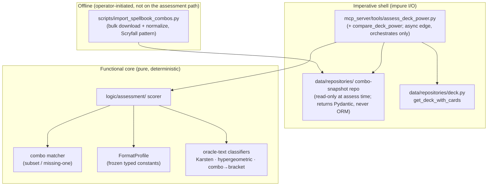
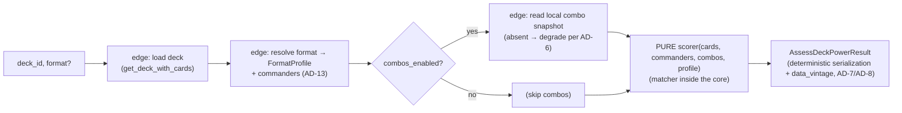

# Architecture Spine — deck-power-assessment

## Design Paradigm

**Functional core, imperative shell** — layered onto the project's existing
`data → logic → mcp_server → ui` import direction.

- **Imperative shell (impure, does all I/O):** the async MCP tools (`src/mcp_server`) plus
  two data-layer pieces (the Spellbook **bulk-snapshot importer** — an offline script, not on
  the assessment path — and the combo-snapshot repository in `src/data`). The edge loads the
  deck, reads the local combo snapshot, and shapes output. **Assessment performs no network
  I/O at all.**
- **Functional core (pure, deterministic):** `src/logic/assessment/` — the scorer,
  `FormatProfile` data, Karsten mana math, hypergeometric consistency, oracle-text
  classifiers, the **combo matcher** (subset / missing-one), and the combo→bracket mapping.
  It takes already-resolved inputs (`list[Card]`, commanders, combo variants as plain values,
  a `FormatProfile`) and returns the assessment. **No network, no DB, no clock.**

This split is the whole architecture: it is what makes determinism (NFR1) hold and the
diff use case (goal #2) trustworthy — the same deck, card snapshot, and combo snapshot always
produce byte-identical output regardless of network or wall-clock state.

## Invariants & Rules



### AD-1 — assess_deck_power and compare_deck_power are async MCP tools, siblings to the Epic-1 analysis tools

- **Binds:** FR1, FR26, NFR7; tool registration in `src/mcp_server/server.py`.
- **Prevents:** a sync/threadpool tool diverging from the three analysis tools it sits beside
  and needing a separate connection story.
- **Rule:** Register `assess_deck_power` (and the thin `compare_deck_power`, FR26) as
  **`async def`** tools that `await` `get_deck_with_cards` on the FastMCP event loop (D-1.3a),
  exactly like `analyze_mana_curve` / `detect_synergies` / `validate_deck`. (The Epic-2
  sqlite-vec search tools are sync only because the vec index needs the sync connection — not
  applicable here.) Statelessness holds: `deck_id`(s) / `format` are the only inputs; no
  per-session server state. `compare_deck_power` composes two assessments through the same pure
  pipeline and computes deltas in code — it introduces no second scoring path.

### AD-2 — Pure deterministic core, impure edge; combo data enters the core frozen

- **Binds:** NFR1, NFR2, FR16, FR17; the regression/determinism test surface.
- **Prevents:** network or DB state leaking into scores; two builders tangling fetch into the
  scoring math and breaking the diff guarantee.
- **Rule:** All scoring lives in `src/logic/assessment/` as pure functions —
  `score(cards, commanders, combos, profile) -> assessment`. The core performs **no** network,
  DB, or clock access. The edge reads combo variants from the local snapshot repository and
  passes them into the core as **frozen plain values**; matching happens inside the core. Given
  identical `(cards, commanders, combos, profile)` the core is a pure function.

### AD-3 — FormatProfile is passive frozen data; the scorer holds all behavior

- **Binds:** NFR8, FR4, FR19, FR20; the Commander/Standard fork.
- **Prevents:** scattered magic numbers, untyped external-data-file drift, and scoring logic
  splitting across per-format strategy classes.
- **Rule:** Per-dimension signal→0–100 mappings, aggregate weights, expected-win-turn band,
  rubric selector (`brackets | heuristic_only`), and flags (`combos_enabled`,
  `multiplayer_variance_caveat` — drives a fixed `summary` caveat, **not** a confidence reason)
  live as **typed frozen constants in an in-repo Python `FormatProfile` module**, one profile per
  format — not an external data file, not inline literals. The profile is a **passive data
  bag**; the single deterministic scorer reads it and branches on it. Adjusting weights = edit
  the module, bump the version, re-run the benchmark. The profile does **not** claim a Game
  Changers or combo-data version — data vintage belongs to the imported snapshots and is
  surfaced via `data_vintage` (AD-7), so the profile can never lie about what data was used.

### AD-4 — game_changer is nullable; NULL means "unknown" and degrades confidence

- **Binds:** FR11, NFR3; `CardModel` / `Card` schema, `transform_scryfall_card`.
- **Prevents:** a confidently-wrong Bracket 2 on a pre-backfill DB silently corrupting a diff.
- **Rule:** Add `game_changer` as a **nullable** column (`bool | None`) via a hand-written
  additive migration script in `scripts/` (no Alembic), populated in `transform_scryfall_card`
  from the Scryfall bulk `game_changer` field. `NULL` = not-yet-populated (the window between
  migration and backfill/re-import). If **any** deck card has `game_changer IS NULL`, the edge
  adds confidence reason `game_changer_data_unavailable` and the absent count **must not** lower
  the Commander Bracket floor. Every reader treats `None` as a distinct state — **never** coalesce
  to `False`. Backfilling `game_changer` requires a Scryfall **re-import** (the field can't be
  derived locally); the interim degraded-confidence window is expected until that runs.

### AD-5 — Combo data is a locally imported snapshot table; assessment is read-only

- **Binds:** FR13, FR14, FR15, NFR1, NFR4.
- **Prevents:** a live dependency on the assessment path; network state leaking into scores;
  an analysis tool writing to `cards.db`; snapshot shape coupling to Spellbook's wire schema.
- **Rule:** The Commander Spellbook **bulk variant export** is imported into a **dedicated
  snapshot table in `cards.db`** (D2 single-file topology) by an operator-initiated script
  (`scripts/import_spellbook_combos.py`) — the same operational pattern as the Scryfall import
  and the `card_vec` build. The import normalizes wire fields into canonical `ComboRecord` rows
  (**AD-11**) under a versioned row schema — not raw JSON — and writes a **metadata row**
  carrying `imported_at` and the export version (the source of `data_vintage`, AD-7).
  **`assess_deck_power` never writes** — every analysis tool remains read-only against
  `cards.db`, and no WAL/journal coupling with the search connection exists on the assessment
  path. The table is truncatable/rebuildable and, like `card_vec`, is a **build prerequisite,
  never committed**: a missing/empty snapshot degrades as `combo_data_unavailable` (AD-6),
  mirroring `index_unavailable`. The repository in `src/data/repositories` returns Pydantic
  schemas (never ORM) and exposes the variants plus the metadata row; it performs no matching —
  matching is pure core (AD-9).

### AD-6 — Degradation lowers confidence; it never crashes or silently scores zero

- **Binds:** NFR3, FR3, FR21; mirrors the `index_unavailable` pattern.
- **Prevents:** a missing combo snapshot, unresolved cards, or absent GC data producing either a crash
  or a confidently-wrong score.
- **Rule:** Every degradation maps to a categorical confidence level (`low | medium | high`) and
  a `reasons[]` drawn from a **closed snake_case token enum** — exactly `cards_unresolved`,
  `combo_data_unavailable`, `game_changer_data_unavailable`, `commander_unidentified` — never an
  exception or a silent zero. A token **never embeds a count or free phrase** — embedded numbers
  (`"2 cards unresolved"`) break AD-8 sorted determinism (`"10…" < "2…"`) and manufacture diff
  noise; any count lives in a separate structured field, and human phrasing appears **only** in
  the `summary`. `structural_gaps[]` (FR9) is likewise a closed token enum. Degradation sources:
  - Unresolved/ambiguous cards (FR3) → count field + `cards_unresolved`.
  - Combo snapshot missing/empty (FR14) → combos absent + `combo_data_unavailable` + degrade.
  - GC data NULL → `game_changer_data_unavailable` (AD-4).
  - Commander unidentifiable (FR25/AD-13) → `commander_unidentified` + commander-required
    variants skipped.
  **Reasons are run-specific degradations only.** Commander's irreducible multiplayer variance is
  a fixed `summary` caveat driven by the profile (AD-3), not a confidence reason. **No
  clock-derived reason may exist** (a "staleness" token computed from `now()` would violate AD-8
  determinism); freshness is the caller's judgment, informed by `data_vintage` (AD-7).
  A categorical level only — **no numeric confidence band in v1** (it would imply calibration the
  deterministic v1 lacks).

### AD-7 — One versioned Pydantic Result carrying both human summary and structured assessment

- **Binds:** FR22, FR23, FR24; matches the sibling `*Result` convention.
- **Prevents:** a caller mis-diffing two runs across a silent shape change.
- **Rule:** Return a single `AssessDeckPowerResult` with: a `status` enum
  (`ok | deck_not_found | unsupported_format | database_not_initialized | error`), a human
  `summary` string, an `assessment` object (or `null` when `status != ok`), and a
  `schema_version` (**always present**). When populated, `assessment` carries: the **7-dimension
  vector** whose keys are a **fixed closed set** (`speed, consistency, resilience, interaction,
  mana_efficiency, card_advantage, combo_potential`) — **all seven always present** regardless of
  format, never omitted; the for-format 0–100 with descriptive tier label; a **`data_vintage`
  block** (combo snapshot `imported_at` + export version, `format_profile_version`) sourced only
  from stored input metadata; `confidence{level, reasons[]}`; and `flags{game_changers, combos,
  structural_gaps, mass_land_denial, extra_turn_chains, cedh_candidate}`. **The shape is fixed —
  no format-conditional keys:** every field is always present; for Standard the Commander-only
  fields hold `bracket: null` and `false` booleans (a diff surface wants a stable shape, and
  absent-vs-false ambiguity is banned). No 1–10 projection is emitted. `cedh_candidate` is homed
  **once**, in `flags`. Shape = the `docs/deck-assess.md` schema **minus** `absolute_score`,
  per-score `low`/`high` band, `percentile`, 1–10, and EDHREC fields. cEDH (Bracket 5) is
  **flagged as candidacy, never asserted**. `compare_deck_power` (FR26) returns a sibling
  versioned `CompareDeckPowerResult` — per-dimension deltas, score delta, bracket change, flags
  added/removed, and **both** `data_vintage` blocks — computed from two `assessment` objects,
  never re-scored independently.

### AD-8 — The Result serializes deterministically; the diff surface excludes the clock

- **Binds:** NFR1 at the output boundary; goal #2.
- **Prevents:** an implementer reaching for `now()` or unsorted sets and silently destroying
  every diff.
- **Rule:** Two runs of the same deck + card snapshot + combo snapshot **must** yield
  byte-identical JSON. Therefore: (1) all flag lists and `confidence.reasons[]` are emitted
  **sorted ascending by their token/string (bytewise)**, never set/insertion order; (2) dimension
  scores are **integer 0–100**; (3) the Result embeds **no call-time clock** — no `assessed_at` /
  `now()`, even though project-context mandates `datetime.now(UTC)` elsewhere; "as of" info comes
  **only** from stored input metadata (`data_vintage`: combo snapshot `imported_at` + export
  version, `format_profile_version`), equal across two runs on the same data. The diff surface is
  the `assessment` block; the human `summary` is a pure, deterministic projection of it.

### AD-9 — Layer placement: I/O adapters at the data layer, pure scoring in logic, edge in mcp_server

- **Binds:** all; the `data → logic → mcp_server` import direction.
- **Prevents:** network/DB creeping into the pure core, or the tool layer accreting domain logic.
- **Rule:** The Spellbook **bulk downloader lives in the importer family at the data layer**
  (sibling to `importers/scryfall_api.py`), invoked only by the offline import script — never on
  the assessment path, never in `src/logic`. The combo-snapshot repository lives in
  `src/data/repositories` and returns Pydantic schemas (never ORM, per the layer contract).
  **Combo matching is a pure function in `src/logic/assessment/`** (a deterministic subset /
  missing-one computation belongs in the core, not behind I/O). All scoring/classification lives
  in `src/logic/assessment/` and stays framework-free. The tools in `src/mcp_server/tools/`
  orchestrate only. Exact filenames are seed; the boundary is the invariant.
- **Downloader policy (FR14):** the import script sets an explicit timeout, required
  `User-Agent` + `Accept` headers, and retries 429/network failures with **manual exponential
  backoff** mirroring `importers/scryfall_api.py` (its `max_retries` / `retry_delay` /
  `2**attempt` loop — **`tenacity` is not a dependency**). A failed download aborts the import
  cleanly and leaves the previous snapshot intact; it never corrupts the table.

### AD-10 — Oracle-text classifiers are one shared taxonomy in logic, not a forked one

- **Binds:** FR6, FR10, FR12, NFR2.
- **Prevents:** two divergent oracle-text vocabularies.
- **Rule:** Ramp/draw/removal/tutor counting (FR6), win-condition tagging (FR10), and
  mass-land-denial + extra-turn detection (FR12) are **new pure functions in
  `src/logic/assessment`** that follow the existing `src/logic/synergy.py` oracle-text
  conventions (lowercased matching over `Card.oracle_text` + `Card.keywords`). They are not
  duplicated into the tool layer, and they share vocabulary rather than re-inventing it.

### AD-11 — One canonical ComboRecord is the single combo shape across snapshot, core, and output

- **Binds:** FR13, FR15, FR23; the snapshot↔core↔output seam.
- **Prevents:** FG4, FG5, and FG6 each inventing a different combo shape — a stored record the
  scorer can't read the trigger from, or an output flag missing the audit fields.
- **Rule:** Define one frozen `ComboRecord` used verbatim by the snapshot repository, the pure
  scorer, and the `flags.combos` output. It carries **Spellbook-sourced fields plus the local
  match verdict**: `{spellbook_id, cards[] (sorted names), commander_required, bucket
  (included | almost_included — assigned by the core matcher, AD-9), bracket_tag, produces,
  popularity}`. **Derived** fields — `type` (e.g. `two_card_infinite`) and
  `earliest_turn_estimate` — are computed in the **pure core** and are **not stored** (so the
  earliest-turn heuristic has a single owner, and re-tuning it doesn't require a re-import).
  `bracket_tag` is a **closed enum** (`RUTHLESS→4, SPICY→3, POWERFUL→3, ODDBALL→2,
  PRECON_APPROPRIATE→2, CASUAL→1`), **normalized once at import time**; the core's
  combo→bracket map keys on it exactly — a casing mismatch must not silently produce a wrong
  Bracket floor.

### AD-12 — Withdrawn (2026-07-12)

- The per-deck cache key existed only to serve the live-API response cache. With the bulk
  snapshot (AD-5) there is no per-deck cache and nothing to key; the matcher (AD-9) consumes
  the deck directly. Withdrawn by `sprint-change-proposal-2026-07-12.md`; the ID is retired,
  not reused. (The general prohibition on builtin `hash()` for any persisted key remains good
  guidance project-wide.)

### AD-13 — Commander identity: explicit flag first, inference fallback, degrade honestly

- **Binds:** FR25, FR13, FR18; `DeckCardModel` / `DeckCard` schema, the Arena importer,
  `add_card_to_deck`.
- **Prevents:** the Bracket rules and commander-required combo variants silently guessing wrong
  — or Epic 7 discovering at integration time that nothing knows which card is the commander.
- **Rule:** `DeckCardModel` gains `commander: bool` (default `False`, additive hand-written
  migration mirroring the `sideboard` bool; two flagged cards = partners). `add_card_to_deck`
  accepts `commander=False`; the Arena importer's `Commander` section sets it. At assess time
  the edge resolves commanders in strict order: (1) flagged cards; (2) if none and the format
  is Commander, a **sole legendary creature** in the mainboard is inferred (no confidence
  penalty); (3) otherwise commanders are unknown — commander-required combo variants are
  skipped and confidence reason `commander_unidentified` is added (AD-6). The resolved
  commander list is passed into the pure core as data; the core never queries for it.

## Consistency Conventions

| Concern | Convention |
| --- | --- |
| Naming | Tools `assess_deck_power` / `compare_deck_power`; results `AssessDeckPowerResult` / `CompareDeckPowerResult`; core package `src/logic/assessment/`; profiles `FormatProfile`. ORM `*Model`, Pydantic unsuffixed. `format` shadows the builtin intentionally (MTG domain). |
| Data & formats | Dimension scores `int` 0–100 (7 fixed keys, all always present); **fixed output shape** (Standard holds `bracket: null` + `false` booleans — no format-conditional keys, no 1–10 projection); `format_profile_version` a single monotonic string per format; `data_vintage` from stored input metadata only; confidence categorical `low\|medium\|high`; `reasons[]` / `structural_gaps[]` / `bucket` / `bracket_tag` are **closed enums**, tokens never embed counts; all output lists sorted bytewise; one canonical `ComboRecord` (AD-11). |
| State & cross-cutting | Stateless tools (`deck_id`(s)/`format` params only); repos return Pydantic, never ORM; core is pure (no network/DB/clock); the offline import script is the only combo-data writer; assessment never writes; degradation → `status`/confidence, never exceptions to the client; module-level `logging` with `%`-style lazy args; `mypy --strict`, ruff, Google docstrings. |

## Stack

Inherited from the project — **no new runtime dependency is introduced**. Bound here only to
record that the feature's needs are already covered (versions read from `pyproject.toml`, current
as of authoring):

| Name | Version |
| --- | --- |
| Python | >=3.12 |
| mcp / FastMCP | >=1.27.0 |
| SQLAlchemy `[asyncio]` + aiosqlite | >=2.0.44 / >=0.21.0 |
| httpx (Spellbook bulk download, offline import only) | >=0.28.1 |
| pydantic (v2) | >=2.0.0 |

## Structural Seed

```text
src/
  data/
    models/card.py            # + game_changer: Mapped[bool | None]  (AD-4)
    models/deck.py            # DeckCardModel + commander: Mapped[bool]  (AD-13)
    schemas/card.py           # + game_changer: bool | None          (AD-4)
    schemas/deck.py           # DeckCard + commander: bool           (AD-13)
    importers/transformers.py # transform_scryfall_card sets game_changer  (AD-4)
    importers/<spellbook>.py  # bulk-export downloader, sibling to scryfall_api.py  (AD-9)
    repositories/<combo_snapshot>.py  # snapshot table repo (read at assess time), returns Pydantic  (AD-5, AD-9)
  logic/
    assessment/               # PURE core (AD-2): scorer, combo matcher, FormatProfile, Karsten,
                              #   hypergeometric, oracle-text classifiers, combo→bracket  (AD-3, AD-9, AD-10)
  mcp_server/
    tools/assess_deck_power.py     # async edge tools (assess + compare), orchestrate only  (AD-1, AD-9)
    server.py                      # + registration
scripts/
  migrate_add_game_changer.py      # hand-written additive migration + backfill  (AD-4)
  migrate_add_deck_card_commander.py  # additive commander-flag migration  (AD-13)
  import_spellbook_combos.py       # offline bulk combo-snapshot import  (AD-5)
```



## Capability → Architecture Map

| Feature group | Lives in | Governed by |
| --- | --- | --- |
| FG1 Ingest, format resolve & commander identity | edge tool + `FormatProfile` + deck `commander` flag | AD-1, AD-3, AD-9, AD-13 |
| FG2 Heuristic extraction | `logic/assessment` (classifiers, Karsten, hypergeometric) | AD-2, AD-10 |
| FG3 Card-power (Game Changer) | `Card.game_changer` schema + scorer read | AD-4 |
| FG4 Combo detection | offline import script + combo-snapshot repo + pure matcher | AD-5, AD-6, AD-9, AD-11 |
| FG5 Score & classify | pure scorer + `FormatProfile` | AD-2, AD-3, AD-11 |
| FG6 Confidence & output (+ compare) | `AssessDeckPowerResult` / `CompareDeckPowerResult` + serialization | AD-6, AD-7, AD-8, AD-11 |

## Deferred

- **Actual dimension signal→0–100 mapping curves + aggregate weight values** (NFR8, PRD §9) —
  owned by first-implementation/calibration; hand-tuned, documented, benchmark-validated. The
  spine fixes *where* they live (`FormatProfile`, AD-3) and that they are frozen/versioned; it
  does not invent the numbers.
- **Benchmark-set composition** (which precons + cEDH lists, PRD §6/§9) — the first
  implementation task; becomes the acceptance signal for the scorer once composed.
- **Combo earliest-turn heuristic** method + confidence (FR16, PRD §9) — owned by the
  implementation phase; feeds the `speed` and `combo_potential` dimensions.
- **Everything in PRD §2.1 / §8 non-goals** — Monte Carlo goldfish, ML/embeddings, Limited/Draft,
  calibrated cross-format absolute score, 60-card meta-tier percentile, EDHREC enrichment.
- **Snapshot-freshness hard gate** — v1 documents the assumed GC-list version in the profile and
  couples freshness to import cadence (AD-4); an enforced staleness check is deferred.
