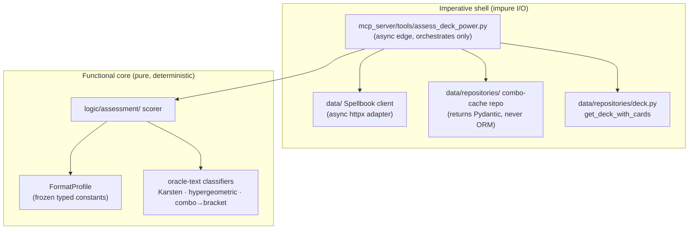
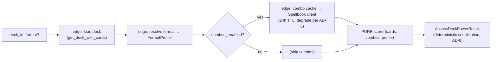

# Architecture Spine — deck-power-assessment

## Design Paradigm

**Functional core, imperative shell** — layered onto the project's existing
`data → logic → mcp_server → ui` import direction.

- **Imperative shell (impure, does all I/O):** the async MCP tool (`src/mcp_server`) plus
  two data-layer adapters (the Spellbook HTTP client and the combo-cache repository in
  `src/data`). It loads the deck, fetches/caches combos, and shapes output.
- **Functional core (pure, deterministic):** `src/logic/assessment/` — the scorer,
  `FormatProfile` data, Karsten mana math, hypergeometric consistency, oracle-text
  classifiers, and the combo→bracket mapping. It takes already-resolved inputs
  (`list[Card]`, combo data as plain values, a `FormatProfile`) and returns the assessment.
  **No network, no DB, no clock.**

This split is the whole architecture: it is what makes determinism (NFR1) hold and the
diff use case (goal #2) trustworthy — the same deck, snapshot, and cached combo data always
produce byte-identical output regardless of network or wall-clock state.

## Invariants & Rules



### AD-1 — assess_deck_power is an async MCP tool, sibling to the Epic-1 analysis tools

- **Binds:** FR1, NFR7; tool registration in `src/mcp_server/server.py`.
- **Prevents:** a sync/threadpool tool diverging from the three analysis tools it sits beside
  and needing a separate connection story.
- **Rule:** Register `assess_deck_power` as an **`async def`** tool that `await`s
  `get_deck_with_cards` on the FastMCP event loop (D-1.3a), exactly like `analyze_mana_curve` /
  `detect_synergies` / `validate_deck`. The live Spellbook call uses **async httpx** on that loop.
  This **overrides PRD NFR7's "sync `def` (threadpool)"**, which was mis-inherited from the
  Epic-2 sqlite-vec search tools (those are sync only because the vec index needs the sync
  connection — not applicable here). Statelessness still holds: `deck_id` / `format` are the only
  inputs; no per-session server state.

### AD-2 — Pure deterministic core, impure edge; combo data enters the core frozen

- **Binds:** NFR1, NFR2, FR16, FR17; the regression/determinism test surface.
- **Prevents:** network or DB state leaking into scores; two builders tangling fetch into the
  scoring math and breaking the diff guarantee.
- **Rule:** All scoring lives in `src/logic/assessment/` as pure functions —
  `score(cards, combos, profile) -> assessment`. The core performs **no** network, DB, or clock
  access. The edge fetches and caches combo data, then passes it into the core as **frozen plain
  values**, so a cache hit and a cache miss yield identical scores. Given identical
  `(cards, combos, profile)` the core is a pure function.

### AD-3 — FormatProfile is passive frozen data; the scorer holds all behavior

- **Binds:** NFR8, FR4, FR19, FR20; the Commander/Standard fork.
- **Prevents:** scattered magic numbers, untyped external-data-file drift, and scoring logic
  splitting across per-format strategy classes.
- **Rule:** Per-dimension signal→0–100 mappings, aggregate weights, expected-win-turn band,
  rubric selector (`brackets | heuristic_only`), and flags (`combos_enabled`,
  `multiplayer_variance`, `game_changers_version`) live as **typed frozen constants in an
  in-repo Python `FormatProfile` module**, one profile per format — not an external data file,
  not inline literals. The profile is a **passive data bag**; the single deterministic scorer
  reads it and branches on it. Adjusting weights = edit the module, bump the version, re-run
  the benchmark.

### AD-4 — game_changer is nullable; NULL means "unknown" and degrades confidence

- **Binds:** FR11, NFR3; `CardModel` / `Card` schema, `transform_scryfall_card`.
- **Prevents:** a confidently-wrong Bracket 2 on a pre-backfill DB silently corrupting a diff.
- **Rule:** Add `game_changer` as a **nullable** column (`bool | None`) via a hand-written
  additive migration script in `scripts/` (no Alembic), populated in `transform_scryfall_card`
  from the Scryfall bulk `game_changer` field. `NULL` = not-yet-populated (the window between
  migration and backfill/re-import). If **any** deck card has `game_changer IS NULL`, the edge
  adds confidence reason `game_changer_data_unavailable` and the absent count **must not** lower
  the Commander Bracket floor. Every reader treats `None` as a distinct state — **never** coalesce
  to `False`. Backfilling `game_changer` requires a Scryfall **re-import** (the field can't be
  derived locally); the interim degraded-confidence window is expected until that runs.

### AD-5 — Combo cache is an ephemeral table in cards.db; the assess edge is its sole writer

- **Binds:** FR13, FR14, FR15, NFR1, NFR4.
- **Prevents:** cold re-fetch per call; network state leaking into scores; cache shape coupling to
  Spellbook's response schema.
- **Rule:** Cache Spellbook results in a **dedicated ephemeral table in `cards.db`** (D2
  single-file topology), reached through a repository in `src/data/repositories` that returns
  Pydantic schemas. Key = the canonical cache key of **AD-12**; row carries `fetched_at` (24h TTL)
  and a list of canonical `ComboRecord`s (**AD-11**) under a versioned cache-row schema — not raw
  JSON. The client reads the paginated Spellbook `results` **envelope** and feeds only the
  **`included`** and **`almostIncluded`** buckets into `ComboRecord`s (the change-commander /
  add-color buckets are excluded — this is a fixed-commander assessment). The table is
  truncatable/rebuildable (like `card_vec`). `assess_deck_power` is the **only** writer (the first
  analysis tool to write to `cards.db`; curve/synergy/validate are read-only) — single
  upsert-by-hash under WAL. The async engine sets only `busy_timeout=5`, **not** WAL (WAL is set
  out-of-band by the search connection and persists per-file), so the **migration must ensure
  `PRAGMA journal_mode=WAL`** — the cache write path must not depend on the search index having
  been built first.

### AD-6 — Degradation lowers confidence; it never crashes or silently scores zero

- **Binds:** NFR3, FR3, FR21; mirrors the `index_unavailable` pattern.
- **Prevents:** a Spellbook outage, unresolved cards, or stale GC data producing either a crash
  or a confidently-wrong score.
- **Rule:** Every degradation maps to a categorical confidence level (`low | medium | high`) and
  a `reasons[]` drawn from a **closed snake_case token enum** (e.g. `cards_unresolved`,
  `combo_data_stale`, `combo_data_unavailable`, `game_changer_data_unavailable`,
  `multiplayer_variance`, `format_profile_stale`), never an exception or a silent zero. A token
  **never embeds a count or free phrase** — embedded numbers (`"2 cards unresolved"`) break AD-8
  sorted determinism (`"10…" < "2…"`) and manufacture diff noise; any count lives in a separate
  structured field, and human phrasing appears **only** in the `summary`. `structural_gaps[]`
  (FR9) is likewise a closed token enum. Degradation sources:
  - Unresolved/ambiguous cards (FR3) → count field + `cards_unresolved`.
  - Combo fetch: fresh cache hit → full contribution; expired entry + fetch fails → use the
    **stale** entry + `combo_data_stale`; no entry + fetch fails → combos absent +
    `combo_data_unavailable` + degrade.
  - GC data NULL → `game_changer_data_unavailable` (AD-4).
  - Commander multiplayer variance and format-profile freshness also lower confidence.
  A categorical level only — **no numeric confidence band in v1** (it would imply calibration the
  deterministic v1 lacks).

### AD-7 — One versioned Pydantic Result carrying both human summary and structured assessment

- **Binds:** FR22, FR23, FR24; matches the sibling `*Result` convention.
- **Prevents:** a caller mis-diffing two runs across a silent shape change.
- **Rule:** Return a single `AssessDeckPowerResult` with: a `status` enum
  (`ok | deck_not_found | unsupported_format | database_not_initialized | error`), a human
  `summary` string, an `assessment` object (or `null` when `status != ok`), and a
  `schema_version` (**always present**). When populated, `assessment` carries: the **7-dimension
  vector** whose keys are a **fixed closed set** (`speed, consistency, resilience, interaction,
  mana_efficiency, card_advantage, combo_potential`) — **all seven always present** regardless of
  format, never omitted; the for-format 0–100 with descriptive tier label; the derived 1–10
  projection (AD-8); `confidence{level, reasons[]}`; and `flags{game_changers, combos,
  structural_gaps, mass_land_denial, extra_turn_chains, cedh_candidate}`. **Flags are
  format-gated:** the Commander-only flags (`bracket`, `mass_land_denial`, `extra_turn_chains`,
  `cedh_candidate`) are absent/`false` for Standard; `cedh_candidate` is homed **once**, in
  `flags`. Shape = the `docs/deck-assess.md` schema **minus** `absolute_score`, per-score
  `low`/`high` band, `percentile`, and EDHREC fields. cEDH (Bracket 5) is **flagged as candidacy,
  never asserted**.

### AD-8 — The Result serializes deterministically; the diff surface excludes the clock

- **Binds:** NFR1 at the output boundary; goal #2.
- **Prevents:** an implementer reaching for `now()` or unsorted sets and silently destroying
  every diff.
- **Rule:** Two runs of the same deck + snapshot + cache **must** yield byte-identical JSON.
  Therefore: (1) all flag lists and `confidence.reasons[]` are emitted **sorted ascending by their
  token/string (bytewise)**, never set/insertion order; (2) dimension scores are **integer
  0–100**; the 1–10 projection is `1 + for_format_score * 9 / 100`, **half-up rounded to 1 decimal
  via `Decimal`**, emitted as a JSON **number** (`7.0`, not `7` or `"7.0"`); (3) the Result embeds
  **no call-time clock** —
  no `assessed_at` / `now()`, even though project-context mandates `datetime.now(UTC)` elsewhere;
  "as of" info comes only from inputs (snapshot date, cache `fetched_at`), equal across two runs.
  The diff surface is the `assessment` block; the human `summary` is a pure, deterministic
  projection of it.

### AD-9 — Layer placement: I/O adapters at the data layer, pure scoring in logic, edge in mcp_server

- **Binds:** all; the `data → logic → mcp_server` import direction.
- **Prevents:** network/DB creeping into the pure core, or the tool layer accreting domain logic.
- **Rule:** The live Spellbook client is an **async httpx I/O adapter at the data layer** (sibling
  to `importers/scryfall_api.py`), never in `src/logic`. The combo-cache repository lives in
  `src/data/repositories` and returns Pydantic schemas (never ORM, per the layer contract). All
  scoring/classification lives in `src/logic/assessment/` and stays framework-free. The tool in
  `src/mcp_server/tools/` orchestrates only. Exact filenames are seed; the boundary is the
  invariant.
- **Spellbook client policy (FR14):** the client sets an explicit timeout, required `User-Agent`
  + `Accept` headers, and polite throttling; it retries 429/network failures with **manual
  exponential backoff** mirroring `importers/scryfall_api.py` (its `max_retries` / `retry_delay` /
  `2**attempt` loop — **`tenacity` is not a dependency**). On exhausted retries it returns cleanly
  so the edge can apply the AD-6 degradation ladder — it never raises to the client.

### AD-10 — Oracle-text classifiers are one shared taxonomy in logic, not a forked one

- **Binds:** FR6, FR10, FR12, NFR2.
- **Prevents:** two divergent oracle-text vocabularies.
- **Rule:** Ramp/draw/removal/tutor counting (FR6), win-condition tagging (FR10), and
  mass-land-denial + extra-turn detection (FR12) are **new pure functions in
  `src/logic/assessment`** that follow the existing `src/logic/synergy.py` oracle-text
  conventions (lowercased matching over `Card.oracle_text` + `Card.keywords`). They are not
  duplicated into the tool layer, and they share vocabulary rather than re-inventing it.

### AD-11 — One canonical ComboRecord is the single combo shape across cache, core, and output

- **Binds:** FR13, FR15, FR23; the cache↔core↔output seam.
- **Prevents:** FG4, FG5, and FG6 each inventing a different combo shape — a cached record the
  scorer can't read the trigger from, or an output flag missing the audit fields.
- **Rule:** Define one frozen `ComboRecord` used verbatim by the cache repository, the pure
  scorer, and the `flags.combos` output. It carries **Spellbook-sourced fields only**:
  `{spellbook_id, cards[] (sorted names), bucket (included | almostIncluded), bracket_tag,
  produces, popularity}`. **Derived** fields — `type` (e.g. `two_card_infinite`) and
  `earliest_turn_estimate` — are computed in the **pure core** and are **not cached** (so the
  earliest-turn heuristic has a single owner, and re-tuning it doesn't require cache
  invalidation). `bracket_tag` is a **closed enum in exact Spellbook wire casing**
  (`RUTHLESS→4, SPICY→3, POWERFUL→3, ODDBALL→2, PRECON_APPROPRIATE→2, CASUAL→1`), normalized once
  at the edge; the core's combo→bracket map keys on it exactly — a casing mismatch must not
  silently produce a wrong Bracket floor.

### AD-12 — One canonical, multiplicity-aware cache key; builtin `hash()` forbidden

- **Binds:** FR14, NFR1; AD-5.
- **Prevents:** two callers hashing the same deck differently (cache misses), and a name-set key
  collapsing a Standard 4-of deck with a 1-of deck (wrong combos served silently).
- **Rule:** The cache key is `sha256` of a **canonical JSON** document
  `{"commanders": [sorted names], "main": {name: qty}}` that **includes card multiplicities**,
  produced by **one named pure helper** that both the read and write paths call. Python's builtin
  `hash()` is forbidden here — it is `PYTHONHASHSEED`-salted and non-deterministic across
  processes, which would silently defeat the cache and NFR1.

## Consistency Conventions

| Concern | Convention |
| --- | --- |
| Naming | Tool `assess_deck_power`; result `AssessDeckPowerResult`; core package `src/logic/assessment/`; profiles `FormatProfile`. ORM `*Model`, Pydantic unsuffixed. `format` shadows the builtin intentionally (MTG domain). |
| Data & formats | Dimension scores `int` 0–100 (7 fixed keys, all always present); 1–10 projection `1 + score*9/100` half-up to 1 decimal, JSON number; `format_profile_version` a single monotonic string per format; confidence categorical `low\|medium\|high`; `reasons[]` / `structural_gaps[]` / `bucket` / `bracket_tag` are **closed enums**, tokens never embed counts; all output lists sorted bytewise; one canonical `ComboRecord` (AD-11) + one canonical cache key (AD-12). |
| State & cross-cutting | Stateless tool (`deck_id`/`format` params only); repos return Pydantic, never ORM; core is pure (no network/DB/clock); edge is the only impure code; degradation → `status`/confidence, never exceptions to the client; module-level `logging` with `%`-style lazy args; `mypy --strict`, ruff, Google docstrings. |

## Stack

Inherited from the project — **no new runtime dependency is introduced**. Bound here only to
record that the feature's needs are already covered (versions read from `pyproject.toml`, current
as of authoring):

| Name | Version |
| --- | --- |
| Python | >=3.12 |
| mcp / FastMCP | >=1.27.0 |
| SQLAlchemy `[asyncio]` + aiosqlite | >=2.0.44 / >=0.21.0 |
| httpx (Spellbook client) | >=0.28.1 |
| pydantic (v2) | >=2.0.0 |

## Structural Seed

```text
src/
  data/
    models/card.py            # + game_changer: Mapped[bool | None]  (AD-4)
    schemas/card.py           # + game_changer: bool | None          (AD-4)
    importers/transformers.py # transform_scryfall_card sets game_changer  (AD-4)
    <spellbook client>.py     # async httpx adapter, sibling to importers/scryfall_api.py  (AD-9)
    repositories/<combo_cache>.py  # ephemeral cache table repo, returns Pydantic  (AD-5, AD-9)
  logic/
    assessment/               # PURE core (AD-2): scorer, FormatProfile, Karsten,
                              #   hypergeometric, oracle-text classifiers, combo→bracket  (AD-3, AD-10)
  mcp_server/
    tools/assess_deck_power.py     # async edge tool, orchestrates only  (AD-1, AD-9)
    server.py                      # + registration
scripts/
  migrate_add_game_changer.py      # hand-written additive migration + backfill  (AD-4)
```



## Capability → Architecture Map

| Feature group | Lives in | Governed by |
| --- | --- | --- |
| FG1 Ingest & format resolve | edge tool + `FormatProfile` | AD-1, AD-3, AD-9 |
| FG2 Heuristic extraction | `logic/assessment` (classifiers, Karsten, hypergeometric) | AD-2, AD-10 |
| FG3 Card-power (Game Changer) | `Card.game_changer` schema + scorer read | AD-4 |
| FG4 Combo detection | data-layer Spellbook client + combo-cache repo | AD-5, AD-6, AD-9, AD-11, AD-12 |
| FG5 Score & classify | pure scorer + `FormatProfile` | AD-2, AD-3, AD-11 |
| FG6 Confidence & output | `AssessDeckPowerResult` + serialization | AD-6, AD-7, AD-8, AD-11 |

## Deferred

- **Actual dimension signal→0–100 mapping curves + aggregate weight values** (NFR8, PRD §9) —
  owned by first-implementation/calibration; hand-tuned, documented, benchmark-validated. The
  spine fixes *where* they live (`FormatProfile`, AD-3) and that they are frozen/versioned; it
  does not invent the numbers.
- **Benchmark-set composition** (which precons + cEDH lists, PRD §6/§9) — the first
  implementation task; becomes the acceptance signal for the scorer once composed.
- **Combo earliest-turn heuristic** method + confidence (FR16, PRD §9) — owned by the
  implementation phase; feeds the `speed` and `combo_potential` dimensions.
- **Everything in PRD §2.1 / §8 non-goals** — Monte Carlo goldfish, ML/embeddings, Limited/Draft,
  calibrated cross-format absolute score, 60-card meta-tier percentile, EDHREC enrichment.
- **Snapshot-freshness hard gate** — v1 documents the assumed GC-list version in the profile and
  couples freshness to import cadence (AD-4); an enforced staleness check is deferred.
