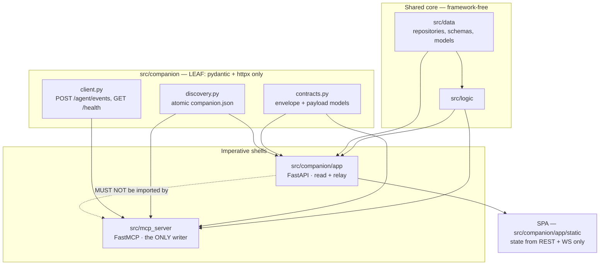
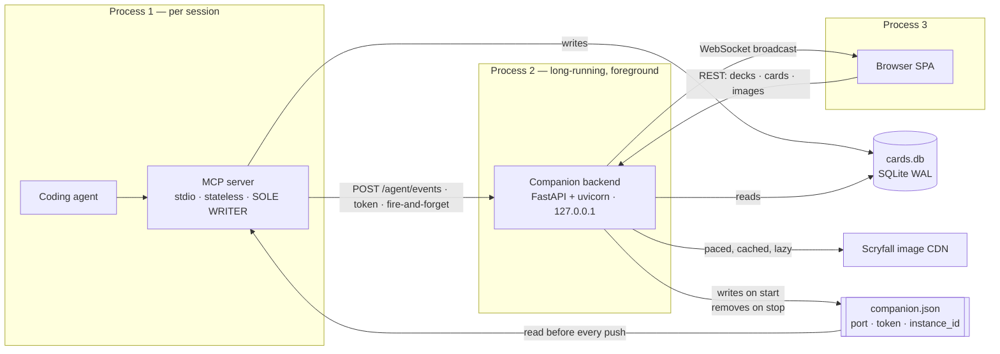
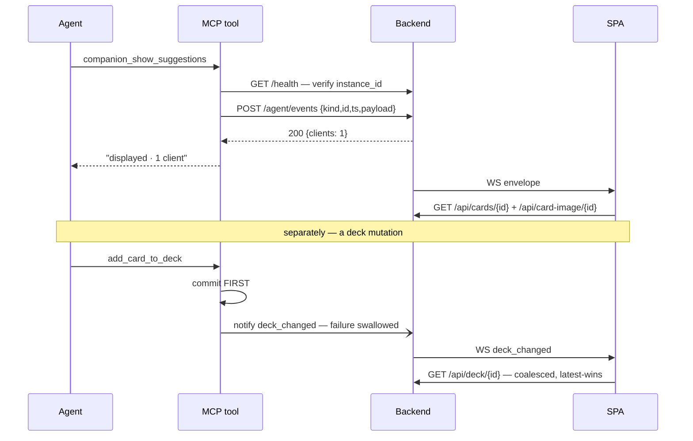

# Architecture Spine — companion-app

## Design Paradigm

**Single-writer read model with a fire-and-forget relay.** Two imperative shells over one
shared core, inside the project's existing `data → logic → (mcp_server | companion)` import
direction.

- **The writer** — `src/mcp_server` (FastMCP over stdio, per-session, stateless). It is the
  **only** process that mutates `cards.db`. After a mutation commits it *tells* the companion
  backend; it never waits and never depends on the answer.
- **The read model + relay** — `src/companion/app` (FastAPI, long-running, user-launched). It
  reads the same database, holds ephemeral display state (active deck, connections, tickets),
  and relays agent pushes to browsers. It **never writes**.
- **The glass** — the SPA. State comes from exactly two inputs: REST responses and WebSocket
  messages. It issues no writes at all.

Every state change therefore travels one direction: agent → MCP tool → SQLite → notification →
browser refetch. Nothing flows back. That single-direction property is what makes "the agent
drives, the app shows" a structural fact rather than a UI convention — and it is the property
every AD below protects.

## Inherited Invariants

Project-level constraints, already settled. Not re-derived here; a local decision that
contradicts one is a conflict, not an override.

| Inherited | From | Binds here |
| --- | --- | --- |
| Import direction `data → logic → shells`; `src/data` + `src/logic` stay framework-free | project-context.md | `src/companion` is a shell; no FastAPI import may appear below it |
| Repositories return Pydantic schemas, never ORM models | project-context.md | REST handlers receive schemas; the wire layer never sees a `*Model` |
| MCP tools are stateless — no per-session server state | project-context.md D5, PRD CM-3 | Active deck lives in the *backend*, never in the MCP server |
| No Alembic — hand-written `scripts/migrate_*.py` | project-context.md | The companion adds no tables; if it ever does, same pattern |
| `mypy --strict`, ruff line-length 100, Google docstrings, module docstrings, `%`-style lazy logging | project-context.md, NFR-07 | Applies to `src/companion` from the first commit |
| stdout belongs to the JSON-RPC stream in the MCP process; diagnostics go to stderr | `src/mcp_server/__main__.py` | Inverted in the companion process — see AD-15 |
| Closed snake_case token enums for status/reasons; tokens never embed counts or free phrases | deck-power spine AD-6/AD-7 | The companion tool outcome vocabulary follows it — AD-8 |

## Invariants & Rules



### AD-1 — Two shells over one core; the companion is a peer of the MCP server, not a layer under it

- **Binds:** all; FR-02, FR-03, NFR-02, NFR-03.
- **Prevents:** a second card/deck truth drifting from the repositories — the failure mode of a
  separate read service with its own SQLite layer.
- **Rule:** `src/companion/` is a sibling of `src/mcp_server/`, both sitting on the same
  `src/data` + `src/logic`. The backend consumes the **existing repositories** and their Pydantic
  schemas; it defines no second card or deck shape. Neither shell imports the other's app
  surface (AD-3). The backend is **not** an MCP client — the MCP server is spawned per session
  and the backend is long-running, so there is no lifetime in which one can serve the other.

### AD-2 — The MCP server is the only writer; `src/companion` cannot reach a write path

- **Binds:** NFR-02, CM-3, NG1, G4; the read-only-glass premise.
- **Prevents:** a future story — most plausibly Phase-3 UI-initiated edits — finding a write path
  already open and using it, collapsing the product premise without any decision being made.
- **Rule:** One engine, one session-factory recipe, shared with the MCP side. **Read-only is
  enforced by a CI import boundary, not by `mode=ro`:** a test AST-walks every module under
  `src/companion/**` and fails on any reference to a repository write method, `session.add`,
  `session.commit`, or `session.delete`. This is deliberate — `mode=ro` on a WAL database drags
  in the `-shm` recipe the addendum flagged as a Windows landmine, and `immutable` would
  foreclose FR-16. **PRD NFR-02 must be amended**, since it names `mode=ro` as the mechanism.
  The same test file also enforces AD-3.

### AD-3 — `src/companion` splits into a dependency-free leaf and the FastAPI app; only the leaf is importable by the MCP server

- **Binds:** FR-06, FR-08, FR-09, FR-10, FR-12, FR-14, FR-23, NFR-03, NFR-07.
- **Prevents:** a stdio MCP session transitively importing FastAPI and uvicorn merely to read a
  port number — and the two peer shells growing a mutual dependency that makes either
  untestable alone.
- **Rule:** `contracts.py`, `discovery.py` and `client.py` are the **leaf**: they import
  `pydantic`, `httpx`, `src.paths` and nothing else from `src`. `app/` holds FastAPI, uvicorn,
  routes, WebSocket, image proxy and in-memory state. CI-checked:
  `src/mcp_server/**` **may** import `src.companion.contracts | discovery | client`; it **may
  not** import `src.companion.app.*`. Nothing under `app/` is imported by anything outside
  `src/companion/app/`.

### AD-4 — The discovery file is the sole rendezvous, homes under `platformdirs`, and identity is verified before the token is sent

- **Binds:** FR-01, FR-12, FR-14, NFR-01, NFR-09.
- **Prevents:** hardcoded ports; a tool POSTing a live token at a foreign process squatting on a
  recycled port; and the product's data splitting across two locations on disk.
- **Rule:** `src.paths.data_dir()/companion.json` — beside `cards.db` and `fastembed_cache`,
  honouring `PLANESWALKER_DATA_DIR` so tests and parallel dev instances isolate for free.
  **Not** the PRD's `~/.artificial-planeswalker/`; **FR-14 and the glossary must be amended.**
  Contents `{port, token, instance_id}`, written **atomically** (temp + rename) by the lifespan
  and removed on clean shutdown. A parse failure is treated as *app not running*, never an
  error. Before sending the token, a caller calls `GET /health` and matches the echoed
  `instance_id`; a mismatch or failure is *app not running*. **Exactly one instance runs:** at
  startup a verified-live entry makes the new process exit with "already running"; a stale or
  dead entry is reclaimed. Nothing hardcodes port 8765 except the default bind attempt, which
  falls back to an ephemeral port.

### AD-5 — Two credentials that never touch: the agent token authorises pushing, the ticket authorises receiving

- **Binds:** NFR-01, NFR-04; the addendum's delegated ticket-lifecycle item.
- **Prevents:** an XSS or an open devtools escalating from "can read the UI" to "can push
  arbitrary content into the user's session" — which is what happens the moment one credential
  does both jobs.
- **Rule:** The **agent token** lives in the discovery file, authorises `POST /agent/events`, and
  **never reaches the browser** — no HTML embed, no REST response, no WS frame. The **WS ticket**
  is minted by same-origin `GET /api/session`, is **single-use with a 30 s TTL**, and is consumed
  and destroyed at the WebSocket upgrade; every reconnect attempt mints a fresh one. The two
  share no storage and no code path. Every endpoint **including the WS upgrade** validates the
  `Host` header against `127.0.0.1:{port}` / `localhost:{port}` to block DNS rebinding, **and the
  upgrade additionally validates `Origin`** — `Host` identifies what was addressed, `Origin`
  identifies the calling page, and NFR-01's threat model is a malicious local page. CORS is
  restricted to the app's own origin; the socket binds `127.0.0.1` only.

### AD-6 — One WebSocket envelope, discriminated by `kind`

- **Binds:** FR-06, FR-08, FR-09, FR-10, FR-11, FR-18, FR-23, NFR-03.
- **Prevents:** one builder shipping `{type, data}` and another `{kind, payload, ts}`, leaving the
  store with two switch statements — and FR-18's history with no common field to key on.
- **Rule:** Every WebSocket message is `{kind, id, ts, payload}`. `kind` is a **closed enum**
  covering agent pushes (`suggestions | swaps | tier_list | groups`) **and** system signals
  (`deck_changed`) alike. `id` is unique per push and **opaque** — it carries identity and dedupe,
  never ordering; **FR-18 history orders by `ts`**, which is `datetime.now(UTC)`. One Pydantic
  discriminated union, one generated TS union, one switch.
  This does **not** reopen OQ-2: that ruling rejected a generic `companion_display` **tool** for
  agent-affordance reasons and says nothing about the wire shape — four distinct tools feeding
  one envelope satisfies both.

### AD-7 — Payload shapes are per-kind over a bare card reference; over-cap is rejected, never truncated; card IDs are not validated at ingest

- **Binds:** FR-08, FR-09, FR-10, FR-13, FR-23, NFR-03, NFR-05, SC-1, CM-1. Resolves **OQ-A**.
- **Prevents:** four tools inventing four item shapes the UI can't share a tile component
  across; a partial render that reads as the complete answer; and a DB round-trip on the
  latency-critical push path.
- **Rule:** Cards are referenced by **Scryfall printing UUID only** (`cards.id` /
  `deck_cards.card_id`); the UI hydrates everything else through FR-03/FR-04. Each kind defines
  its own item shape over that reference — **not** one fat optional-bag:
  - `suggestions` → `{card_id, reason, category?}`
  - `swaps` → `{out_card_id, in_card_id, rationale, out_qty, in_qty}`
  - `tier_list` → `{letter: Literal["S","A","B","C","D"], name, note?, card_ids[]}`
  - `groups` → `{title, rationale, card_ids[]}` — may reference cards **outside** the active deck

  Every payload carries an optional agent-authored `title`. The tier **letter** stays a closed
  enum so DESIGN's five-colour ramp is total; the free `name` carries the MTG meaning
  ("Auto-include", "Filler", "Cut") — the design's tier chip already renders both.
  **Caps** (pydantic, at the endpoint): ≤ 60 items or card IDs per list, ≤ 12 groups or tiers,
  `reason` ≤ 200 chars, `rationale` ≤ 600, `title` ≤ 80, envelope ≤ 64 KB. Over-cap returns
  **422** — AD-8 turns that into a text result, so the agent presents in chat and nothing is
  lost. **The backend shape-validates and relays; it never reads the database on the push path.**
  Unknown IDs degrade **per entry** in the UI; a push never fails wholesale. **Empty payloads are
  accepted** and render the deliberate empty state.

### AD-8 — Companion tools return a closed outcome token and never raise; auth failure retries exactly once

- **Binds:** FR-06, FR-12, CM-1; mirrors the project's existing status-token convention.
- **Prevents:** a companion tool erroring an agent turn because a browser tab was closed; and
  each tool inventing its own failure vocabulary.
- **Rule:** Every companion tool is `async def` (matching the Epic-1 tools — a blocking POST in a
  sync tool would hold a FastMCP threadpool worker for a whole round-trip) and returns a compact
  text result carrying exactly one token from the closed set `displayed | app_not_running |
  no_clients_connected | payload_rejected | backend_error`, plus the connected-client count that
  `POST /agent/events` reports. It **never raises** and **never echoes the payload** back into
  chat — results stay under ~200 tokens (CM-1). On an auth rejection the tool **re-reads the
  discovery file and retries once**, so a backend restarted mid-session with a new token is
  picked up transparently.

### AD-9 — `deck_changed` is emitted by one shared notifier, after commit, with failure swallowed

- **Binds:** FR-11, NFR-04; the addendum's "mutation persists but event POST fails" item.
- **Prevents:** each mutation tool growing its own emit path; and — the real damage — an
  emission failure degrading a mutation that already succeeded.
- **Rule:** One fire-and-forget notifier in the companion **leaf**, called by every deck-mutation
  tool **after the transaction commits**, never inside it. Deletion counts as a mutation. All
  exceptions are caught and logged; the mutation's own result is never affected.
  **"Fire-and-forget" means a bounded-timeout `await` (~1 s), not a detached task.** A
  `create_task` that outlives its tool call can be torn down before it runs — the event never
  leaves the process and the deck view silently goes stale, which is precisely the failure this
  AD exists to prevent. Detached tasks are banned; the timeout is what caps the mutation's
  latency cost. The event carries the deck ID; the UI refetches when it matches the active deck.
  The staleness window left by a swallowed emission is **accepted** until FR-16, and the UI shows
  no staleness warning.

### AD-10 — `build_app()` has zero side effects; the lifespan owns everything external; the DB engine is lazy

- **Binds:** FR-01, FR-14, FR-22, NFR-07.
- **Prevents:** an app object that cannot be constructed in a test without binding a port and
  overwriting the real discovery file — and a fresh install erroring instead of guiding.
- **Rule:** Constructing the ASGI app touches nothing outside the process. **Everything with an
  external effect belongs to the lifespan:** port bind and ephemeral fallback, discovery-file
  write and removal, image-cache directory creation, engine creation. The **database engine is
  created lazily and its absence is a served UI state, not a startup failure** — this is what
  makes FR-22 hold. Testing follows from it: the bulk runs in-process over `httpx.ASGITransport`
  and the existing in-process MCP client, and **exactly one** `integration`-marked test boots a
  real backend on an ephemeral port with a real discovery file, a real client, a real WS upgrade
  and ticket consume, and a restart-mints-new-token retry case. Seams that only fail in a real
  process get exercised in a real process; nothing else pays for sockets.

### AD-11 — The image proxy paces at one backend-global choke point; the cache is content-addressed, atomic, and unbounded

- **Binds:** FR-04, FR-19, NFR-05, NFR-06, NFR-08, NFR-09, CM-2.
- **Prevents:** two components each implementing their own rate limiter and jointly exceeding
  Scryfall's guidance; per-tile hotlinking; and a request storm against an unreachable CDN.
- **Rule:** All card imagery routes through `GET /api/card-image/{scryfall_id}?size=&face=`;
  the SPA never contacts Scryfall. **Fetching is lazy** — only what a tab asks for — behind a
  **single backend-global semaphore plus request spacing**, never delegated to the UI. Pacing is
  `async` throughout — it must never block the event loop, or a queued image burst would eat the
  250 ms push budget. CDN URLs resolve from the **locally stored `image_uris`**; no live Scryfall
  metadata call is ever made.
  **Face handling is driven by the presence of per-face `image_uris` inside `card_faces` — never
  by a layout string.** `cards` has **no `layout` column** (verified against
  `src/data/models/card.py`), and the presence test is the more precise signal anyway:
  split/adventure/flip carry `card_faces` *without* per-face `image_uris`, so they fall out as
  single-image automatically, and meld backs are separate printings. PRD FR-04's `layout` wording
  needs the same correction. **The backend never serves a substitute image:** a fetch failure and
  a card with no image data are signalled **distinguishably** so the client renders DESIGN.md's
  named placeholder — name, mana pips, type line — which only the client has the data to draw.
  Serving a generic grey card would make that placeholder unreachable and degrade the app to
  silent rectangles.
  Cache path `data_dir()/image_cache/<id[0:2]>/<id>/<size>_<face>.<ext>` — sharded two hex
  characters because a flat directory would reach ~60k entries — written **temp + rename**.
  Failures are **negative-cached with backoff**; a card with no `image_uris` is never fetched.
  Unknown `size` → 400; missing `face` → 404; single-faced with `face=0` → the image.
  **No eviction in MVP:**
  the cache is unbounded with a documented location and a clear command (NFR-09). Accepted
  consequence, stated rather than discovered: a cold 100-card deck is roughly 12 MB and ~10 s to
  fully paint — compliant, since NFR-05 excludes first-fetch paint.

### AD-12 — Pydantic is the single source of truth; TypeScript is generated from FastAPI's own OpenAPI and drift-checked in CI

- **Binds:** NFR-03, NFR-07; the schema-drift risk row. Resolves **OQ-B**.
- **Prevents:** the Python and TS halves of the envelope silently diverging — the failure that
  shows up as a runtime `undefined` in the browser and nowhere in either test suite.
- **Rule:** Contracts are Pydantic models in `src/companion/contracts.py`. TS types are generated
  by **`openapi-typescript`** from the backend's own `app.openapi()` output into a **committed**
  `.d.ts`, and CI regenerates and runs `git diff --exit-code` — the same drift-check pattern the
  `plugin/` tree already uses. **One generator covers both halves**, because `POST /agent/events`
  declares the envelope union as its request body, so the WS types land in OpenAPI components
  with no dummy endpoint and no second tool. (`datamodel-code-generator`, listed in PRD OQ-B,
  generates Python *from* schemas and was never a candidate.) The REST layer is the schema
  boundary: **the UI never assumes DB schema**, and its state comes from exactly two inputs —
  REST responses and WebSocket messages. Nothing else may write the store.
  **Card hydration has one owner:** a single card cache in the zustand store, keyed by card ID,
  that dedupes in-flight requests. The detail panel updates on *hover* across a 100-tile grid and
  every agent view hydrates its own thumbnails, so per-component fetching would fire duplicate
  requests for the same card on every cursor sweep. **No second data-fetching or state library**
  joins zustand.

### AD-13 — The built SPA is a committed artifact under `src/companion/app/static/`

- **Binds:** SC-4, NFR-07, FR-01, NFR-06.
- **Prevents:** a plugin install shipping a backend with no UI to serve.
- **Rule:** Forced by the distribution model, not chosen freely: the project ships as a Claude
  Code plugin via a **cloned tree**, so a build hook that compiles at wheel-build time would
  leave plugin users with nothing. The bundle is committed at `src/companion/app/static/` and
  mirrored into `plugin/` by the existing rebuild + drift-check machinery. Both copies are
  **generated artifacts** — never hand-edited. **Node is dev/CI-only** and must not be required
  at install or runtime. The font is **self-hosted with these assets**; no CDN import, or the app
  stops rendering identically offline (NFR-06).

### AD-14 — One console script dispatches; bare invocation still runs the MCP server

- **Binds:** SC-4, FR-01.
- **Prevents:** a second console script that would need PRD and UX copy amended in three places
  — and, worse, a dispatcher that swallows the bare invocation.
- **Rule:** `artificial-planeswalker` becomes a subcommand dispatcher: no arguments runs the MCP
  server **exactly as today**; `companion` runs the backend. Verified safe — both `.mcp.json` and
  `plugin/.mcp.json` invoke `python -m src.mcp_server` directly, so no MCP client configuration
  touches the console script. `uv run artificial-planeswalker companion` is the single documented
  launch command, matching the copy already written into PRD UJ-1/SC-4 and EXPERIENCE.md.

### AD-15 — The companion supersedes `src/viewer`; the backend is a foreground process that owns its stdout

- **Binds:** G1, FR-05, FR-17, FR-19, SC-3, FR-01, FR-12, FR-14.
- **Prevents:** two renderers of one entity diverging — and a story "improving" `view_deck` after
  the decision to retire it.
- **Rule:** `view_deck` is **deprecated at Phase 1** — its docstring names the companion as the
  replacement — but keeps rendering HTML through Phases 1-2, so SC-3 holds through the
  transition; `src/viewer` is **removed at the next minor** once the companion is proven. No new
  capability lands in `src/viewer`, and the companion never reuses `template.html`.
  **Operational envelope:** the backend is a foreground, user-launched, **single-instance** local
  process — no daemon, no service install, no auto-restart. Unlike the MCP process it **logs
  freely to stdout/stderr**, because it owns them. A crash leaves a stale discovery file that the
  next start reclaims (AD-4) and that tools read as *app not running*.

### AD-16 — REST is HTTP-native, not MCP-shaped; one typed error body carries a closed reason token

- **Binds:** FR-02, FR-03, FR-07, FR-11, FR-22, NFR-02's degradation row, NFR-03.
- **Prevents:** the project's `*Result`-with-`status` tool convention leaking into HTTP, where one
  builder ships `200 {"status":"ok","deck":{…}}` and another ships `200 Deck` / `404` — and, more
  damagingly, the UI being unable to tell a **deleted deck** (FR-11 → no-active-deck) from a
  **missing database** (FR-22 → "Database not initialized") from a **transient read failure**
  (→ "Database updating"), which are three distinct surfaces reached through the same endpoint.
- **Rule:** HTTP status codes carry the outcome; success bodies are the **existing Pydantic
  schemas directly**, unwrapped. The MCP `status`-enum convention stops at the MCP boundary and
  does not cross into REST. Every non-2xx returns one typed error body carrying a **closed
  snake_case `reason` token** that maps 1:1 onto a UX state: `deck_not_found` (404) →
  no-active-deck; `database_not_initialized` (503) → the fresh-install panel;
  `database_unavailable` (503) → "Database updating"; `invalid_request` (400);
  `payload_too_large` (422, AD-7). Adding a UI state means adding a token here first.
  **Deck-existence validation for `companion_set_active_deck` belongs to the MCP tool** — it has
  DB access and it is the one that must report `deck_not_found` to the agent; the backend stores
  what it is given. AD-7's no-DB-read rule governs the *push* path only; `set_active_deck` is
  control, not a push.

## Consistency Conventions

| Concern | Convention |
| --- | --- |
| Naming | Package `src/companion/`; leaf modules `contracts.py` / `discovery.py` / `client.py`; app under `app/`. Tools `companion_set_active_deck`, `companion_show_{suggestions,swaps,tier_list,groups}`. Wire models `CompanionEvent` + `{Kind}Payload`; ORM `*Model`, Pydantic unsuffixed. `format` shadows the builtin intentionally. |
| Data & formats | Card identity is the **Scryfall printing UUID**, everywhere, always. Envelope `{kind, id, ts, payload}`; `kind` and the tier `letter` are closed enums; tool outcomes are closed snake_case tokens carrying no counts or free phrases. Timestamps `datetime.now(UTC)`. Image cache keyed by `id + size + face`. REST is the schema boundary — the UI never assumes DB schema. |
| State & cross-cutting | Active deck, connections and tickets live **in backend memory only** and are gone on restart; the MCP server stays stateless. Freshness is "something changed, refetch" — no diffs, no patches; refetch coalesces latest-wins. Event delivery is fire-and-forget. Errors degrade to a served state or a text token, never an exception to the client and never a red error page. Module-level `logging` with `%`-style lazy args. `mypy --strict`, ruff, Google docstrings. Frontend gets equivalent tooling (eslint, prettier, vitest) in CI from the first commit. |

## Stack

Verified current 2026-07-25. Bound as `>=` floors, matching the project's existing
`pyproject.toml` convention. Everything above FastAPI is already a project dependency.

| Name | Version |
| --- | --- |
| Python | >=3.12 |
| pydantic (v2) | >=2.0.0 |
| httpx | >=0.28.1 |
| platformdirs | >=4.0.0 |
| SQLAlchemy `[asyncio]` + aiosqlite | >=2.0.44 / >=0.21.0 |
| mcp / FastMCP | >=1.27.0 |
| FastAPI | >=0.139.2 |
| uvicorn `[standard]` | >=0.51.0 |
| Vite | >=8.0 |
| React | >=19.2 |
| TypeScript | >=5.9,<6.1 — **upper bound is load-bearing**, see below |
| zustand | >=5.0 |
| openapi-typescript *(dev/CI only)* | >=7 |
| Node *(dev/CI only — never at install or runtime)* | >=20 |

**TypeScript is the one pin, not a floor.** TypeScript 7.0 went stable 2026-07-08 (the Go-native
compiler, ~10× faster) — but `typescript-eslint` declined TS 7 support on day one and publishes a
peer range of `<6.1.0`, so `npm ci` fails outright and ESLint crashes if forced. NFR-07 requires
eslint in CI, so an open-ended floor would resolve to TS 7 and break the frontend gate on the
first run. The bound lifts once TS 7.1 ships a stable programmatic API.

## Structural Seed





```text
src/
  companion/
    __init__.py
    contracts.py            # LEAF — envelope + per-kind payloads  (AD-3, AD-6, AD-7)
    discovery.py            # LEAF — atomic companion.json r/w     (AD-4)
    client.py               # LEAF — /health + /agent/events, notifier  (AD-8, AD-9)
    app/
      main.py               # build_app() — zero side effects; lifespan owns effects  (AD-10)
      deps.py               # lazy engine + session dependency     (AD-2, AD-10)
      state.py              # active deck, connections, tickets — in memory  (AD-5)
      security.py           # Host validation, token, ticket mint/consume  (AD-5)
      routes/               # decks, cards, session, health, agent_events
      ws.py                 # upgrade + ticket consume + broadcast  (AD-5, AD-6)
      images.py             # proxy: pacer, disk cache, negative cache  (AD-11)
      static/               # COMMITTED SPA build output            (AD-13)
  mcp_server/
    tools/companion.py      # async companion_* tools               (AD-8)
    __main__.py             # subcommand dispatcher                 (AD-14)
ui/                         # SPA source — Vite/React/zustand; builds into app/static
  src/api/types.d.ts        # GENERATED by openapi-typescript, committed, drift-checked  (AD-12)
tests/
  unit/companion/test_import_boundary.py      # write guard + leaf/app guard  (AD-2, AD-3)
  integration/companion/test_live_backend.py  # the ONE real-socket test      (AD-10)
```

## Capability → Architecture Map

| Feature group | Lives in | Governed by |
| --- | --- | --- |
| A — Backend service & lifecycle (FR-01, 14, 22) | `app/main.py`, `discovery.py`, `deps.py` | AD-4, AD-10, AD-14, AD-15 |
| B — Deck view (FR-02, 03, 05, 17, 19) | `app/routes/`, existing repositories, SPA | AD-1, AD-2, AD-12, AD-16 |
| C — Card imagery (FR-04) | `app/images.py` | AD-11 |
| D — Agent panel / pushed content (FR-06, 08, 09, 10, 13, 18, 23) | `contracts.py`, `app/routes/agent_events`, `app/ws.py`, `tools/companion.py` | AD-6, AD-7, AD-8, AD-12 |
| E — Deck sync & agent control (FR-07, 11, 16) | `app/state.py`, `client.py` notifier, mutation tools | AD-6, AD-9, AD-16 |
| F — Resilience & status (FR-12, 15) | `client.py`, `app/routes/health`, SPA connection pill | AD-4, AD-8, AD-10, AD-16 |
| G — Visual experience (FR-20, 21) | `ui/`, `app/static/` | AD-13; DESIGN.md + EXPERIENCE.md are the contract |
| Security envelope (NFR-01) | `app/security.py`, `app/ws.py` | AD-5 |
| Contract integrity (NFR-03) | `contracts.py` → generated `types.d.ts` | AD-12 |
| Latency & freshness (NFR-04, NFR-05) | push path, `app/images.py`, store refetch | AD-7 (no DB read on push), AD-9, AD-11 (paced, async, first-fetch excluded) |

## Deferred

- **FR-16 out-of-band change detection** (`PRAGMA data_version` polling) — Phase 3. The accepted
  staleness window from a swallowed emission (AD-9) is the interim behaviour, and the UI shows no
  staleness warning. Deferring it is *why* AD-2 rejects `immutable`.
- **FR-21 deck power panel** and **Tauri wrapping** — Phase 3. Neither changes this architecture:
  the panel is another push kind under AD-6/AD-7, and a wrapper loads the same URL.
- **UI-initiated deck edits** — explicitly a future brief. AD-2's boundary is what forces that
  brief to be *written* rather than absorbed silently.
- **Image cache eviction** — unbounded in MVP with a documented path and clear command (AD-11).
  Revisit when a real footprint exists to size a policy against, not before.
- **FR-18 session-history home** — the UX spine's open residual: extend the nav, or a strip inside
  each view's header. A UX decision; AD-6's `id` + `ts` make either buildable.
- **Arrow-key grid navigation** — deferred by the UX gate; the skip link is the mitigation, and
  EXPERIENCE.md flags it for revisit before public release.
- **Browser-level E2E (Playwright)** — AD-10 stops at one real-socket test. SC-5 is a human gate
  already being performed; revisit if the UX contract starts regressing unnoticed.
- **Cross-tab state sync** — every tab gets every push; view state and unread markers are per-tab.
  Divergence between tabs is accepted, not solved.
- **TypeScript 7 adoption** — pinned out by the Stack note until TS 7.1 ships a stable
  programmatic API and `typescript-eslint` supports it. A ~10× type-check speedup is worth
  revisiting for, but not at the cost of NFR-07's lint gate.
- **Observability for the companion process** — the project's `logfire` integration is optional
  and MCP-side. Stdout logging (AD-15) is the MVP floor; structured telemetry has no requirement
  driving it yet.
