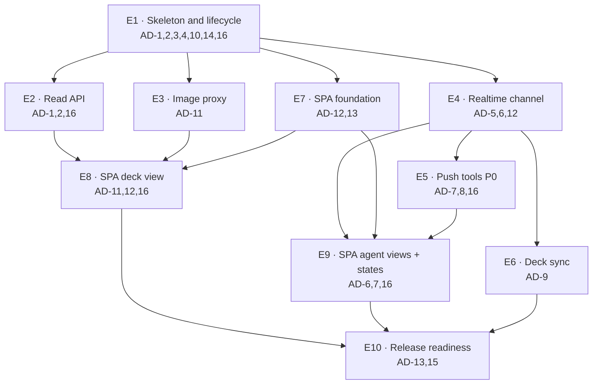

# Companion App — how the work splits

A view of the spine as buildable units: what each owns, which `AD`s govern it, and what
genuinely blocks what. **This is input to `bmad-create-epics-and-stories`, not a substitute for
it** — it fixes the dependency shape and the AD ownership, not the story breakdown.

Two rules drove the split:

1. **An epic owns a seam, not a layer.** "Realtime channel" owns the ticket, the upgrade, the
   envelope and the generated types together, because splitting them would put one contract
   under two owners.
2. **Everything that touches the same `AD` lands in one epic.** If two epics both had to obey
   AD-11, they would eventually disagree about it.

## Dependency shape

## Phase 1 — MVP

FR-01–08, 11–14, 17, 19, 20, 22; NFR-01–04, 06, 08, 09.

| # | Epic | Owns | Governed by | Blocked by |
|---|---|---|---|---|
| **E1** | Companion skeleton & lifecycle | `src/companion` leaf/app split; `build_app()` with zero side effects; the lifespan; discovery file (atomic write, single-instance takeover, `instance_id`); `GET /health`; port fallback; CLI subcommand dispatch; lazy engine + DB-missing state; **both CI boundary tests** (write guard, leaf/app guard) | AD-1, AD-2, AD-3, AD-4, AD-10, AD-14, AD-16 | — |
| **E2** | Read API | `GET /api/decks`, `/api/deck/{id}`, `/api/cards/{id}` over the existing repositories; the typed error body + closed reason tokens | AD-1, AD-2, AD-16 | E1 |
| **E3** | Image proxy | `GET /api/card-image/…`; global async pacer + semaphore; sharded atomic disk cache; negative cache; face resolution from per-face `image_uris`; the never-a-substitute-image rule | AD-11 | E1 |
| **E4** | Realtime channel | `GET /api/session` ticket mint; WS upgrade with ticket consume + Host/Origin validation; broadcast; **`contracts.py` envelope**; `openapi-typescript` generation + CI drift check | AD-5, AD-6, AD-12 | E1 |
| **E5** | Push tools (P0 slice) | `POST /agent/events` with caps; `companion_set_active_deck`; `companion_show_suggestions`; the closed outcome-token vocabulary; retry-once on auth failure | AD-7, AD-8, AD-16 | E4 |
| **E6** | Deck sync | The shared notifier in the leaf; every mutation tool emitting `deck_changed` after commit with bounded-timeout await | AD-9 | E4 |
| **E7** | SPA foundation | Vite/React/zustand scaffold; Voltglass tokens + self-hosted font; build into `app/static/`; plugin mirror + drift check; eslint/prettier/vitest in CI; the single card-hydration cache | AD-12, AD-13 | E1 (contracts land in E4) |
| **E8** | SPA deck view | Grid, text list, mana curve, colour distribution, persistent detail panel, format check, DFC flip control, named placeholders, refetch coalescing | AD-11, AD-12, AD-16 | E2, E3, E7 |
| **E9** | SPA agent views + system states | Agent-view shell + Suggestions view; nav pills + unread; connection pill; all four state panels; footer attribution; focus/reduced-motion floor | AD-6, AD-7, AD-16 | E4, E5, E7 |
| **E10** | Release readiness | `view_deck` deprecation; README cache-stewardship + uninstall notes; the two PRD amendments; **SC-5 gate** | AD-13, AD-15 | E6, E8, E9 |

### What can run in parallel

- After **E1**: E2, E3, E4 and E7 are four independent tracks. E1 is the only true bottleneck —
  it establishes the app object, the lifespan and the two boundary tests everything else is
  checked against, so it is worth doing carefully rather than quickly.
- After **E4**: E5 and E6 are independent of each other (different tools, one shared leaf).
- **E7 can start before E4 finishes** — the scaffold, tokens and build pipeline don't need
  contracts. It only blocks on E4 at the point it imports generated types.
- **E8 and E9 are independent** and touch mostly different components.

### The one serialisation worth respecting

`contracts.py` (E4) is upstream of E5, E7's type imports, E8 and E9. **Land the envelope and the
generation pipeline early and change them rarely** — every later epic reads them, and AD-12's
drift check means a late change ripples through a committed `.d.ts` and both mirrored bundles.

## Phase 2

FR-09, 10, 15, 18, 23; NFR-05 hardening.

| # | Epic | Owns | Governed by |
|---|---|---|---|
| **E11** | Remaining push kinds | `companion_show_swaps`, `companion_show_tier_list`, `companion_show_groups` + their three views. Each is *additive under an existing envelope* — new payload models, new view components, no new seam | AD-6, AD-7 |
| **E12** | Session history + status polish | FR-18 history (needs the UX residual decided first); FR-15 connection status detail | AD-6 |
| **E13** | NFR-05 profiling | Measure against the 250 ms / 1 s budgets and close gaps | AD-7, AD-11 |

Phase 2 is deliberately cheap **because** AD-6 and AD-7 were settled in Phase 1: three new tools
and three new views, each landing under contracts that already exist.

## Phase 3

FR-16 (`data_version` polling), FR-21 (power panel), Tauri wrapper, UI-initiated deck edits
(new brief). None changes the architecture — see the spine's Deferred section. **AD-2's write
boundary is what forces the deck-edits brief to be written rather than absorbed.**

## Cross-cutting, from the first commit

NFR-07 is not an epic. Ruff, mypy strict, pytest, pre-commit and CI apply to `src/companion` from
its first line, and eslint/prettier/vitest to `ui/` from its first line. The two boundary tests
(AD-2, AD-3) land in **E1** precisely so every later epic is born under them.

## Story-shaping notes

- **E1's boundary tests are the highest-leverage stories in the whole feature.** They are what
  make AD-2 and AD-3 real rather than aspirational, and they are cheapest to write before there
  is any code to retrofit them against.
- **E3 carries the only externally-paced work.** Its acceptance should include the cold-deck
  timing (~10 s for 100 cards) as an expected observation, not a defect.
- **E9 carries the accessibility floor.** EXPERIENCE.md's focus management, reduced-motion
  inventory and live-region rules are acceptance criteria, not polish.
- **E10's SC-5 gate is a human judgement by Brad** and cannot be automated or delegated.
